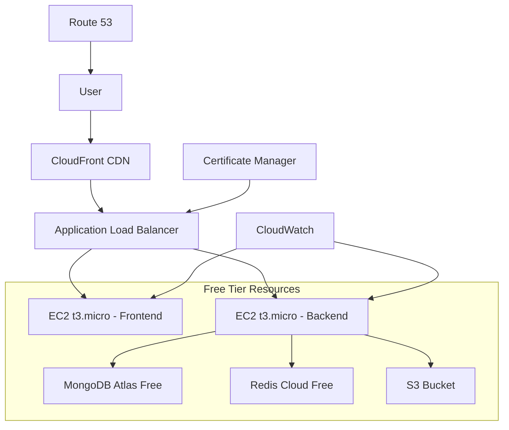

# 🚀 AWS Deployment Guide - IntelliChat Pro (Free Tier Optimized)

## 📋 Overview

Complete **AWS deployment strategy** optimized for **Free Tier usage** while maintaining production-ready architecture. This guide ensures cost-effective deployment with scalability options for future growth.

---

## 💰 AWS Free Tier Resources Overview

### 🎯 **Free Tier Limits (12 months)**
```yaml
compute:
  ec2:
    instance: "t3.micro (1 vCPU, 1GB RAM)"
    hours: "750 hours/month"
    storage: "30GB EBS General Purpose (SSD)"
  
  containers:
    fargate:
      vcpu: "0.25 vCPU hours/month (limited)"
      memory: "0.5 GB hours/month (limited)"
  
storage:
  s3:
    storage: "5GB Standard Storage"
    requests: "20,000 Get + 2,000 Put requests"
  
database:
  rds:
    instance: "db.t3.micro (1 vCPU, 1GB RAM)"
    hours: "750 hours/month"
    storage: "20GB SSD"
  
  documentdb: # MongoDB alternative
    instance: "Not included in free tier"
    alternative: "MongoDB Atlas Free Tier (512MB)"
  
networking:
  cloudfront:
    data_transfer: "1TB outbound/month"
    requests: "10M HTTP/HTTPS requests"
  
  load_balancer:
    classic: "750 hours/month"
    application: "750 hours/month"
  
cache:
  elasticache:
    instance: "t3.micro (limited hours)"
    alternative: "Redis Cloud Free Tier (30MB)"

monitoring:
  cloudwatch:
    metrics: "10 custom metrics"
    logs: "5GB ingestion"
    alarms: "10 alarms"
```

---

## 🏗️ Architecture Design (Free Tier Optimized)

### 📊 **Infrastructure Overview**


### 🎯 **Service Allocation Strategy**
```typescript
interface FreeTeierStrategy {
  compute: {
    strategy: "Single EC2 instance with Docker containers";
    instance_type: "t3.micro";
    usage: "Both frontend and backend on same instance";
    reasoning: "Maximize 750 hours limit efficiency";
  };
  
  database: {
    primary: "MongoDB Atlas Free Tier (512MB)";
    cache: "Redis Cloud Free Tier (30MB)";
    reasoning: "Avoid AWS DocumentDB costs";
  };
  
  storage: {
    files: "S3 Standard (5GB limit)";
    logs: "CloudWatch Logs (5GB limit)";
    backups: "S3 + lifecycle policies";
  };
  
  networking: {
    cdn: "CloudFront (1TB transfer)";
    domain: "Route 53 (50 queries included)";
    ssl: "ACM (free certificates)";
  };
  
  monitoring: {
    metrics: "CloudWatch (10 custom metrics)";
    logs: "CloudWatch Logs";
    alerts: "10 free alarms";
  };
}
```

---

## 🐳 Containerized Deployment Strategy

### 📦 **Docker Configuration**

#### **Multi-Service Docker Compose**
```yaml
# docker-compose.aws.yml
version: '3.8'

services:
  # Frontend (Next.js)
  frontend:
    build:
      context: ./frontend
      dockerfile: Dockerfile.prod
    ports:
      - "3000:3000"
    environment:
      - NODE_ENV=production
      - NEXT_PUBLIC_API_URL=http://localhost:3001
      - NEXT_PUBLIC_WS_URL=ws://localhost:3001
    depends_on:
      - backend
    restart: unless-stopped
    mem_limit: 400m
    cpus: 0.4

  # Backend (Express.js)
  backend:
    build:
      context: ./backend
      dockerfile: Dockerfile.prod
    ports:
      - "3001:3001"
    environment:
      - NODE_ENV=production
      - PORT=3001
      - MONGODB_URI=${MONGODB_URI}
      - REDIS_URL=${REDIS_URL}
      - GROQ_API_KEY=${GROQ_API_KEY}
      - JWT_SECRET=${JWT_SECRET}
      - AWS_REGION=${AWS_REGION}
      - S3_BUCKET=${S3_BUCKET}
    restart: unless-stopped
    mem_limit: 500m
    cpus: 0.5

  # Nginx Reverse Proxy
  nginx:
    image: nginx:alpine
    ports:
      - "80:80"
      - "443:443"
    volumes:
      - ./nginx/nginx.conf:/etc/nginx/nginx.conf
      - ./nginx/ssl:/etc/nginx/ssl
    depends_on:
      - frontend
      - backend
    restart: unless-stopped
    mem_limit: 100m
    cpus: 0.1
```

#### **Production Dockerfiles**

**Frontend Dockerfile**
```dockerfile
# frontend/Dockerfile.prod
FROM node:18-alpine AS base

# Dependencies stage
FROM base AS deps
WORKDIR /app
COPY package.json package-lock.json ./
RUN npm ci --only=production && npm cache clean --force

# Build stage
FROM base AS builder
WORKDIR /app
COPY package.json package-lock.json ./
RUN npm ci
COPY . .
RUN npm run build

# Runtime stage
FROM base AS runner
WORKDIR /app

ENV NODE_ENV production

RUN addgroup --system --gid 1001 nodejs
RUN adduser --system --uid 1001 nextjs

COPY --from=builder /app/public ./public
COPY --from=builder --chown=nextjs:nodejs /app/.next/standalone ./
COPY --from=builder --chown=nextjs:nodejs /app/.next/static ./.next/static

USER nextjs

EXPOSE 3000
ENV PORT 3000

CMD ["node", "server.js"]
```

**Backend Dockerfile**
```dockerfile
# backend/Dockerfile.prod
FROM node:18-alpine AS base

# Dependencies stage
FROM base AS deps
WORKDIR /app
COPY package.json package-lock.json ./
RUN npm ci --only=production && npm cache clean --force

# Build stage
FROM base AS builder
WORKDIR /app
COPY package.json package-lock.json ./
RUN npm ci
COPY . .
RUN npm run build

# Runtime stage
FROM base AS runner
WORKDIR /app

ENV NODE_ENV production

RUN addgroup --system --gid 1001 nodejs
RUN adduser --system --uid 1001 nodejs

COPY --from=deps /app/node_modules ./node_modules
COPY --from=builder /app/dist ./dist
COPY package.json ./

USER nodejs

EXPOSE 3001
ENV PORT 3001

CMD ["node", "dist/server.js"]
```

---

## 🚀 AWS Infrastructure Setup

### 🔧 **Terraform Configuration**

#### **Main Infrastructure**
```hcl
# terraform/main.tf
terraform {
  required_version = ">= 1.0"
  required_providers {
    aws = {
      source  = "hashicorp/aws"
      version = "~> 5.0"
    }
  }
}

provider "aws" {
  region = var.aws_region
}

# Variables
variable "aws_region" {
  description = "AWS region"
  type        = string
  default     = "us-east-1"
}

variable "environment" {
  description = "Environment name"
  type        = string
  default     = "production"
}

variable "app_name" {
  description = "Application name"
  type        = string
  default     = "intellichat-pro"
}

# Data sources
data "aws_availability_zones" "available" {
  state = "available"
}

# VPC Configuration
resource "aws_vpc" "main" {
  cidr_block           = "10.0.0.0/16"
  enable_dns_hostnames = true
  enable_dns_support   = true

  tags = {
    Name        = "${var.app_name}-vpc"
    Environment = var.environment
  }
}

# Internet Gateway
resource "aws_internet_gateway" "main" {
  vpc_id = aws_vpc.main.id

  tags = {
    Name        = "${var.app_name}-igw"
    Environment = var.environment
  }
}

# Public Subnets
resource "aws_subnet" "public" {
  count             = 2
  vpc_id            = aws_vpc.main.id
  cidr_block        = "10.0.${count.index + 1}.0/24"
  availability_zone = data.aws_availability_zones.available.names[count.index]

  map_public_ip_on_launch = true

  tags = {
    Name        = "${var.app_name}-public-subnet-${count.index + 1}"
    Environment = var.environment
    Type        = "Public"
  }
}

# Route Table
resource "aws_route_table" "public" {
  vpc_id = aws_vpc.main.id

  route {
    cidr_block = "0.0.0.0/0"
    gateway_id = aws_internet_gateway.main.id
  }

  tags = {
    Name        = "${var.app_name}-public-rt"
    Environment = var.environment
  }
}

# Route Table Association
resource "aws_route_table_association" "public" {
  count          = length(aws_subnet.public)
  subnet_id      = aws_subnet.public[count.index].id
  route_table_id = aws_route_table.public.id
}
```

#### **EC2 Instance Configuration**
```hcl
# terraform/ec2.tf

# Security Group for EC2
resource "aws_security_group" "app_sg" {
  name_prefix = "${var.app_name}-app-"
  vpc_id      = aws_vpc.main.id

  # HTTP
  ingress {
    from_port   = 80
    to_port     = 80
    protocol    = "tcp"
    cidr_blocks = ["0.0.0.0/0"]
  }

  # HTTPS
  ingress {
    from_port   = 443
    to_port     = 443
    protocol    = "tcp"
    cidr_blocks = ["0.0.0.0/0"]
  }

  # SSH
  ingress {
    from_port   = 22
    to_port     = 22
    protocol    = "tcp"
    cidr_blocks = ["0.0.0.0/0"] # Restrict to your IP in production
  }

  # Application ports
  ingress {
    from_port   = 3000
    to_port     = 3001
    protocol    = "tcp"
    cidr_blocks = ["0.0.0.0/0"]
  }

  egress {
    from_port   = 0
    to_port     = 0
    protocol    = "-1"
    cidr_blocks = ["0.0.0.0/0"]
  }

  tags = {
    Name        = "${var.app_name}-app-sg"
    Environment = var.environment
  }
}

# Key Pair
resource "aws_key_pair" "app_key" {
  key_name   = "${var.app_name}-key"
  public_key = file("~/.ssh/id_rsa.pub") # Generate with ssh-keygen
}

# EC2 Instance
resource "aws_instance" "app" {
  ami                    = "ami-0c7217cdde317cfec" # Amazon Linux 2023
  instance_type          = "t3.micro"               # Free tier eligible
  key_name               = aws_key_pair.app_key.key_name
  vpc_security_group_ids = [aws_security_group.app_sg.id]
  subnet_id              = aws_subnet.public[0].id

  root_block_device {
    volume_type = "gp3"
    volume_size = 20    # Free tier includes 30GB
    encrypted   = true
  }

  user_data = base64encode(templatefile("${path.module}/user_data.sh", {
    app_name = var.app_name
  }))

  tags = {
    Name        = "${var.app_name}-app"
    Environment = var.environment
    Type        = "Application"
  }
}

# Elastic IP
resource "aws_eip" "app" {
  instance = aws_instance.app.id
  domain   = "vpc"

  tags = {
    Name        = "${var.app_name}-eip"
    Environment = var.environment
  }
}
```

#### **User Data Script**
```bash
#!/bin/bash
# terraform/user_data.sh

# Update system
yum update -y

# Install Docker
yum install -y docker
systemctl start docker
systemctl enable docker
usermod -a -G docker ec2-user

# Install Docker Compose
curl -L "https://github.com/docker/compose/releases/latest/download/docker-compose-$(uname -s)-$(uname -m)" -o /usr/local/bin/docker-compose
chmod +x /usr/local/bin/docker-compose

# Install Git
yum install -y git

# Install Node.js (for debugging)
curl -fsSL https://rpm.nodesource.com/setup_18.x | bash -
yum install -y nodejs

# Create application directory
mkdir -p /opt/${app_name}
chown ec2-user:ec2-user /opt/${app_name}

# Install CloudWatch agent
yum install -y amazon-cloudwatch-agent

# Configure CloudWatch agent
cat > /opt/aws/amazon-cloudwatch-agent/etc/amazon-cloudwatch-agent.json << 'EOL'
{
  "metrics": {
    "namespace": "IntelliChat/Application",
    "metrics_collected": {
      "cpu": {
        "measurement": ["cpu_usage_idle", "cpu_usage_iowait", "cpu_usage_user", "cpu_usage_system"],
        "metrics_collection_interval": 300,
        "totalcpu": false
      },
      "disk": {
        "measurement": ["used_percent"],
        "metrics_collection_interval": 300,
        "resources": ["*"]
      },
      "diskio": {
        "measurement": ["io_time"],
        "metrics_collection_interval": 300,
        "resources": ["*"]
      },
      "mem": {
        "measurement": ["mem_used_percent"],
        "metrics_collection_interval": 300
      }
    }
  },
  "logs": {
    "logs_collected": {
      "files": {
        "collect_list": [
          {
            "file_path": "/opt/${app_name}/logs/application.log",
            "log_group_name": "/aws/ec2/${app_name}",
            "log_stream_name": "{instance_id}/application"
          }
        ]
      }
    }
  }
}
EOL

# Start CloudWatch agent
/opt/aws/amazon-cloudwatch-agent/bin/amazon-cloudwatch-agent-ctl -a fetch-config -m ec2 -c file:/opt/aws/amazon-cloudwatch-agent/etc/amazon-cloudwatch-agent.json -s
```

---

## 📡 External Services Configuration

### 🍃 **MongoDB Atlas Setup**
```yaml
# Free Tier Configuration
mongodb_atlas:
  cluster_tier: "M0"        # Free tier
  storage: "512MB"          # Free tier limit
  region: "AWS / us-east-1" # Match AWS region
  backup: "No backups"      # Not available in free tier
  
connection_limits:
  max_connections: 500      # Free tier limit
  connection_pooling: true  # Optimize connections

optimization:
  indexes:
    - collection: "users"
      fields: ["email", "username"]
    - collection: "conversations"
      fields: ["userId", "status", "createdAt"]
    - collection: "messages"
      fields: ["conversationId", "createdAt"]
  
  data_compression: true
  schema_validation: true
```

### 🔴 **Redis Cloud Setup**
```yaml
# Free Tier Configuration
redis_cloud:
  plan: "30MB Free"
  region: "AWS us-east-1"
  eviction_policy: "allkeys-lru"
  
usage_optimization:
  session_storage:
    ttl: 1800              # 30 minutes
    prefix: "sess:"
  
  cache_strategy:
    user_context: 3600     # 1 hour
    conversation: 1800     # 30 minutes
    temporary_data: 300    # 5 minutes

connection:
  max_connections: 30      # Free tier limit
  connection_pooling: true
```

---

## 🔧 Application Load Balancer Setup

### ⚖️ **ALB Configuration**
```hcl
# terraform/alb.tf

# Application Load Balancer
resource "aws_lb" "app" {
  name               = "${var.app_name}-alb"
  internal           = false
  load_balancer_type = "application"
  security_groups    = [aws_security_group.alb_sg.id]
  subnets            = aws_subnet.public[*].id

  enable_deletion_protection = false

  tags = {
    Name        = "${var.app_name}-alb"
    Environment = var.environment
  }
}

# Security Group for ALB
resource "aws_security_group" "alb_sg" {
  name_prefix = "${var.app_name}-alb-"
  vpc_id      = aws_vpc.main.id

  ingress {
    from_port   = 80
    to_port     = 80
    protocol    = "tcp"
    cidr_blocks = ["0.0.0.0/0"]
  }

  ingress {
    from_port   = 443
    to_port     = 443
    protocol    = "tcp"
    cidr_blocks = ["0.0.0.0/0"]
  }

  egress {
    from_port   = 0
    to_port     = 0
    protocol    = "-1"
    cidr_blocks = ["0.0.0.0/0"]
  }

  tags = {
    Name        = "${var.app_name}-alb-sg"
    Environment = var.environment
  }
}

# Target Groups
resource "aws_lb_target_group" "frontend" {
  name     = "${var.app_name}-frontend-tg"
  port     = 3000
  protocol = "HTTP"
  vpc_id   = aws_vpc.main.id

  health_check {
    enabled             = true
    healthy_threshold   = 2
    interval            = 30
    matcher             = "200"
    path                = "/"
    port                = "traffic-port"
    protocol            = "HTTP"
    timeout             = 5
    unhealthy_threshold = 2
  }

  tags = {
    Name        = "${var.app_name}-frontend-tg"
    Environment = var.environment
  }
}

resource "aws_lb_target_group" "backend" {
  name     = "${var.app_name}-backend-tg"
  port     = 3001
  protocol = "HTTP"
  vpc_id   = aws_vpc.main.id

  health_check {
    enabled             = true
    healthy_threshold   = 2
    interval            = 30
    matcher             = "200"
    path                = "/health"
    port                = "traffic-port"
    protocol            = "HTTP"
    timeout             = 5
    unhealthy_threshold = 2
  }

  tags = {
    Name        = "${var.app_name}-backend-tg"
    Environment = var.environment
  }
}

# Target Group Attachments
resource "aws_lb_target_group_attachment" "frontend" {
  target_group_arn = aws_lb_target_group.frontend.arn
  target_id        = aws_instance.app.id
  port             = 3000
}

resource "aws_lb_target_group_attachment" "backend" {
  target_group_arn = aws_lb_target_group.backend.arn
  target_id        = aws_instance.app.id
  port             = 3001
}

# Listeners
resource "aws_lb_listener" "frontend" {
  load_balancer_arn = aws_lb.app.arn
  port              = "80"
  protocol          = "HTTP"

  default_action {
    type             = "forward"
    target_group_arn = aws_lb_target_group.frontend.arn
  }
}

# HTTPS Listener (requires SSL certificate)
resource "aws_lb_listener" "frontend_https" {
  load_balancer_arn = aws_lb.app.arn
  port              = "443"
  protocol          = "HTTPS"
  ssl_policy        = "ELBSecurityPolicy-TLS-1-2-2017-01"
  certificate_arn   = aws_acm_certificate.app.arn

  default_action {
    type             = "forward"
    target_group_arn = aws_lb_target_group.frontend.arn
  }
}

# API route
resource "aws_lb_listener_rule" "backend_api" {
  listener_arn = aws_lb_listener.frontend.arn
  priority     = 100

  action {
    type             = "forward"
    target_group_arn = aws_lb_target_group.backend.arn
  }

  condition {
    path_pattern {
      values = ["/api/*"]
    }
  }
}
```

---

## 🌐 CloudFront and SSL Configuration

### 📜 **SSL Certificate**
```hcl
# terraform/ssl.tf

# ACM Certificate
resource "aws_acm_certificate" "app" {
  domain_name       = var.domain_name
  validation_method = "DNS"

  subject_alternative_names = [
    "*.${var.domain_name}"
  ]

  lifecycle {
    create_before_destroy = true
  }

  tags = {
    Name        = "${var.app_name}-cert"
    Environment = var.environment
  }
}

# Route 53 Hosted Zone
resource "aws_route53_zone" "app" {
  name = var.domain_name

  tags = {
    Name        = "${var.app_name}-zone"
    Environment = var.environment
  }
}

# Certificate Validation
resource "aws_acm_certificate_validation" "app" {
  certificate_arn         = aws_acm_certificate.app.arn
  validation_record_fqdns = [for record in aws_route53_record.cert_validation : record.fqdn]
}

# DNS Validation Records
resource "aws_route53_record" "cert_validation" {
  for_each = {
    for dvo in aws_acm_certificate.app.domain_validation_options : dvo.domain_name => {
      name   = dvo.resource_record_name
      record = dvo.resource_record_value
      type   = dvo.resource_record_type
    }
  }

  allow_overwrite = true
  name            = each.value.name
  records         = [each.value.record]
  ttl             = 60
  type            = each.value.type
  zone_id         = aws_route53_zone.app.zone_id
}
```

### ☁️ **CloudFront Distribution**
```hcl
# terraform/cloudfront.tf

# CloudFront Distribution
resource "aws_cloudfront_distribution" "app" {
  origin {
    domain_name = aws_lb.app.dns_name
    origin_id   = "${var.app_name}-ALB"

    custom_origin_config {
      http_port              = 80
      https_port             = 443
      origin_protocol_policy = "http-only"
      origin_ssl_protocols   = ["TLSv1.2"]
    }
  }

  enabled             = true
  is_ipv6_enabled     = true
  comment             = "${var.app_name} CloudFront Distribution"
  default_root_object = "index.html"

  aliases = [var.domain_name]

  # Default cache behavior
  default_cache_behavior {
    allowed_methods  = ["DELETE", "GET", "HEAD", "OPTIONS", "PATCH", "POST", "PUT"]
    cached_methods   = ["GET", "HEAD"]
    target_origin_id = "${var.app_name}-ALB"

    forwarded_values {
      query_string = true
      headers      = ["Authorization", "CloudFront-Forwarded-Proto"]

      cookies {
        forward = "all"
      }
    }

    viewer_protocol_policy = "redirect-to-https"
    min_ttl                = 0
    default_ttl            = 3600
    max_ttl                = 86400
    compress               = true
  }

  # API cache behavior
  ordered_cache_behavior {
    path_pattern     = "/api/*"
    allowed_methods  = ["DELETE", "GET", "HEAD", "OPTIONS", "PATCH", "POST", "PUT"]
    cached_methods   = ["GET", "HEAD", "OPTIONS"]
    target_origin_id = "${var.app_name}-ALB"

    forwarded_values {
      query_string = true
      headers      = ["*"]

      cookies {
        forward = "all"
      }
    }

    viewer_protocol_policy = "redirect-to-https"
    min_ttl                = 0
    default_ttl            = 0
    max_ttl                = 0
    compress               = true
  }

  # Price class (use PriceClass_100 for cost optimization)
  price_class = "PriceClass_100"

  restrictions {
    geo_restriction {
      restriction_type = "none"
    }
  }

  viewer_certificate {
    acm_certificate_arn      = aws_acm_certificate_validation.app.certificate_arn
    ssl_support_method       = "sni-only"
    minimum_protocol_version = "TLSv1.2_2021"
  }

  tags = {
    Name        = "${var.app_name}-cloudfront"
    Environment = var.environment
  }
}

# Route 53 Record for Domain
resource "aws_route53_record" "app" {
  zone_id = aws_route53_zone.app.zone_id
  name    = var.domain_name
  type    = "A"

  alias {
    name                   = aws_cloudfront_distribution.app.domain_name
    zone_id                = aws_cloudfront_distribution.app.hosted_zone_id
    evaluate_target_health = false
  }
}
```

---

## 🔍 Monitoring and Logging

### 📊 **CloudWatch Configuration**
```hcl
# terraform/monitoring.tf

# CloudWatch Log Groups
resource "aws_cloudwatch_log_group" "app" {
  name              = "/aws/ec2/${var.app_name}"
  retention_in_days = 7 # Minimize costs

  tags = {
    Name        = "${var.app_name}-logs"
    Environment = var.environment
  }
}

# CloudWatch Alarms
resource "aws_cloudwatch_metric_alarm" "cpu_utilization" {
  alarm_name          = "${var.app_name}-cpu-utilization"
  comparison_operator = "GreaterThanThreshold"
  evaluation_periods  = "2"
  metric_name         = "CPUUtilization"
  namespace           = "AWS/EC2"
  period              = "300"
  statistic           = "Average"
  threshold           = "80"
  alarm_description   = "This metric monitors ec2 cpu utilization"
  alarm_actions       = [aws_sns_topic.alerts.arn]

  dimensions = {
    InstanceId = aws_instance.app.id
  }

  tags = {
    Name        = "${var.app_name}-cpu-alarm"
    Environment = var.environment
  }
}

resource "aws_cloudwatch_metric_alarm" "memory_utilization" {
  alarm_name          = "${var.app_name}-memory-utilization"
  comparison_operator = "GreaterThanThreshold"
  evaluation_periods  = "2"
  metric_name         = "mem_used_percent"
  namespace           = "IntelliChat/Application"
  period              = "300"
  statistic           = "Average"
  threshold           = "85"
  alarm_description   = "This metric monitors memory utilization"
  alarm_actions       = [aws_sns_topic.alerts.arn]

  tags = {
    Name        = "${var.app_name}-memory-alarm"
    Environment = var.environment
  }
}

# SNS Topic for Alerts
resource "aws_sns_topic" "alerts" {
  name = "${var.app_name}-alerts"

  tags = {
    Name        = "${var.app_name}-alerts"
    Environment = var.environment
  }
}

# SNS Topic Subscription
resource "aws_sns_topic_subscription" "email_alerts" {
  topic_arn = aws_sns_topic.alerts.arn
  protocol  = "email"
  endpoint  = var.alert_email
}
```

---

## 🚀 Deployment Scripts

### 📜 **Deployment Automation**
```bash
#!/bin/bash
# scripts/deploy.sh

set -e

echo "🚀 Starting IntelliChat Pro Deployment..."

# Variables
APP_NAME="intellichat-pro"
AWS_REGION="us-east-1"
INSTANCE_IP=""

# Functions
log() {
    echo "$(date '+%Y-%m-%d %H:%M:%S') - $1"
}

check_prerequisites() {
    log "Checking prerequisites..."
    
    # Check if AWS CLI is installed and configured
    if ! command -v aws &> /dev/null; then
        echo "❌ AWS CLI is not installed"
        exit 1
    fi
    
    # Check if Terraform is installed
    if ! command -v terraform &> /dev/null; then
        echo "❌ Terraform is not installed"
        exit 1
    fi
    
    # Check if Docker is installed
    if ! command -v docker &> /dev/null; then
        echo "❌ Docker is not installed"
        exit 1
    fi
    
    log "✅ Prerequisites check passed"
}

deploy_infrastructure() {
    log "Deploying AWS infrastructure..."
    
    cd terraform
    
    # Initialize Terraform
    terraform init
    
    # Plan deployment
    terraform plan -out=tfplan
    
    # Apply deployment
    terraform apply tfplan
    
    # Get instance IP
    INSTANCE_IP=$(terraform output -raw instance_public_ip)
    
    cd ..
    
    log "✅ Infrastructure deployed. Instance IP: $INSTANCE_IP"
}

build_and_push_code() {
    log "Building and deploying application code..."
    
    # Create deployment package
    tar -czf deployment.tar.gz \
        docker-compose.aws.yml \
        frontend/ \
        backend/ \
        nginx/ \
        scripts/ \
        --exclude='node_modules' \
        --exclude='.git' \
        --exclude='dist' \
        --exclude='.next'
    
    # Copy to EC2 instance
    scp -i ~/.ssh/id_rsa -o StrictHostKeyChecking=no \
        deployment.tar.gz ec2-user@$INSTANCE_IP:/tmp/
    
    # Deploy on instance
    ssh -i ~/.ssh/id_rsa -o StrictHostKeyChecking=no ec2-user@$INSTANCE_IP << 'ENDSSH'
        cd /opt/intellichat-pro
        
        # Extract deployment package
        tar -xzf /tmp/deployment.tar.gz
        
        # Set environment variables
        cat > .env << EOL
NODE_ENV=production
MONGODB_URI=$MONGODB_URI
REDIS_URL=$REDIS_URL
GROQ_API_KEY=$GROQ_API_KEY
JWT_SECRET=$JWT_SECRET
SESSION_SECRET=$SESSION_SECRET
AWS_REGION=us-east-1
S3_BUCKET=intellichat-pro-uploads
EOL
        
        # Stop existing containers
        docker-compose -f docker-compose.aws.yml down || true
        
        # Build and start new containers
        docker-compose -f docker-compose.aws.yml up --build -d
        
        # Clean up old images
        docker system prune -f
ENDSSH
    
    log "✅ Application deployed successfully"
}

setup_monitoring() {
    log "Setting up monitoring and health checks..."
    
    # Create health check script
    ssh -i ~/.ssh/id_rsa -o StrictHostKeyChecking=no ec2-user@$INSTANCE_IP << 'ENDSSH'
        # Create health check script
        cat > /opt/intellichat-pro/health-check.sh << 'EOL'
#!/bin/bash

# Check if containers are running
FRONTEND_STATUS=$(docker-compose -f /opt/intellichat-pro/docker-compose.aws.yml ps -q frontend | wc -l)
BACKEND_STATUS=$(docker-compose -f /opt/intellichat-pro/docker-compose.aws.yml ps -q backend | wc -l)

if [ $FRONTEND_STATUS -eq 0 ] || [ $BACKEND_STATUS -eq 0 ]; then
    echo "❌ Some containers are not running"
    docker-compose -f /opt/intellichat-pro/docker-compose.aws.yml up -d
else
    echo "✅ All containers are running"
fi

# Check application health
FRONTEND_HEALTH=$(curl -s -o /dev/null -w "%{http_code}" http://localhost:3000/ || echo "000")
BACKEND_HEALTH=$(curl -s -o /dev/null -w "%{http_code}" http://localhost:3001/health || echo "000")

if [ $FRONTEND_HEALTH -ne 200 ] || [ $BACKEND_HEALTH -ne 200 ]; then
    echo "❌ Application health check failed"
    # Restart containers
    docker-compose -f /opt/intellichat-pro/docker-compose.aws.yml restart
else
    echo "✅ Application health check passed"
fi
EOL

        chmod +x /opt/intellichat-pro/health-check.sh
        
        # Setup cron job for health checks
        (crontab -l 2>/dev/null; echo "*/5 * * * * /opt/intellichat-pro/health-check.sh >> /var/log/health-check.log 2>&1") | crontab -
ENDSSH
    
    log "✅ Monitoring setup complete"
}

main() {
    check_prerequisites
    deploy_infrastructure
    build_and_push_code
    setup_monitoring
    
    log "🎉 Deployment complete!"
    log "Frontend URL: https://$INSTANCE_IP"
    log "Backend URL: https://$INSTANCE_IP/api"
    log "Instance IP: $INSTANCE_IP"
}

# Run main function
main "$@"
```

### 🔄 **Update Script**
```bash
#!/bin/bash
# scripts/update.sh

set -e

echo "🔄 Updating IntelliChat Pro..."

# Variables
INSTANCE_IP=$(cd terraform && terraform output -raw instance_public_ip)

log() {
    echo "$(date '+%Y-%m-%d %H:%M:%S') - $1"
}

update_application() {
    log "Updating application code..."
    
    # Create deployment package
    tar -czf update.tar.gz \
        frontend/ \
        backend/ \
        docker-compose.aws.yml \
        --exclude='node_modules' \
        --exclude='.git' \
        --exclude='dist' \
        --exclude='.next'
    
    # Copy to EC2 instance
    scp -i ~/.ssh/id_rsa -o StrictHostKeyChecking=no \
        update.tar.gz ec2-user@$INSTANCE_IP:/tmp/
    
    # Update on instance
    ssh -i ~/.ssh/id_rsa -o StrictHostKeyChecking=no ec2-user@$INSTANCE_IP << 'ENDSSH'
        cd /opt/intellichat-pro
        
        # Backup current version
        cp -r frontend frontend.backup
        cp -r backend backend.backup
        
        # Extract new version
        tar -xzf /tmp/update.tar.gz
        
        # Rolling update
        docker-compose -f docker-compose.aws.yml up --build -d --no-deps backend
        sleep 10
        docker-compose -f docker-compose.aws.yml up --build -d --no-deps frontend
        
        # Health check
        sleep 30
        if curl -f http://localhost:3000/ && curl -f http://localhost:3001/health; then
            echo "✅ Update successful"
            rm -rf frontend.backup backend.backup
        else
            echo "❌ Update failed, rolling back"
            mv frontend.backup frontend
            mv backend.backup backend
            docker-compose -f docker-compose.aws.yml up --build -d
            exit 1
        fi
ENDSSH
    
    log "✅ Application updated successfully"
}

update_application
```

---

## 💰 Cost Optimization Strategies

### 📊 **Free Tier Monitoring**
```bash
#!/bin/bash
# scripts/monitor-costs.sh

# AWS CLI commands to monitor free tier usage
echo "📊 Free Tier Usage Report"
echo "=========================="

# EC2 Usage
echo "EC2 t3.micro hours used this month:"
aws cloudwatch get-metric-statistics \
    --namespace AWS/EC2 \
    --metric-name CPUUtilization \
    --dimensions Name=InstanceType,Value=t3.micro \
    --start-time $(date -d '1 month ago' -u +%Y-%m-%dT%H:%M:%S) \
    --end-time $(date -u +%Y-%m-%dT%H:%M:%S) \
    --period 3600 \
    --statistics Maximum \
    --query 'length(Datapoints)'

# S3 Usage
echo "S3 Storage used:"
aws cloudwatch get-metric-statistics \
    --namespace AWS/S3 \
    --metric-name BucketSizeBytes \
    --dimensions Name=BucketName,Value=intellichat-pro-uploads Name=StorageType,Value=StandardStorage \
    --start-time $(date -d '1 day ago' -u +%Y-%m-%dT%H:%M:%S) \
    --end-time $(date -u +%Y-%m-%dT%H:%M:%S) \
    --period 86400 \
    --statistics Average

# CloudFront Usage
echo "CloudFront data transfer:"
aws cloudwatch get-metric-statistics \
    --namespace AWS/CloudFront \
    --metric-name BytesDownloaded \
    --start-time $(date -d '1 month ago' -u +%Y-%m-%dT%H:%M:%S) \
    --end-time $(date -u +%Y-%m-%dT%H:%M:%S) \
    --period 86400 \
    --statistics Sum
```

### 🎯 **Optimization Configuration**
```yaml
# Cost optimization settings
optimization:
  ec2:
    - Use t3.micro instances only
    - Enable detailed monitoring only when needed
    - Use GP3 storage with minimal IOPS
    - Schedule instance stop/start for development
  
  storage:
    - S3 lifecycle policies for log cleanup
    - CloudWatch log retention: 7 days max
    - Delete unused EBS snapshots
  
  networking:
    - CloudFront PriceClass_100 (US, Canada, Europe)
    - Minimize data transfer costs
    - Use compression for all responses
  
  monitoring:
    - Limit custom CloudWatch metrics
    - Use basic monitoring where possible
    - Set up billing alerts at $5, $10, $20
```

---

This comprehensive AWS deployment guide ensures your ChatGPT clone can be deployed cost-effectively on AWS Free Tier while maintaining production-ready architecture and scalability for future growth! 🚀