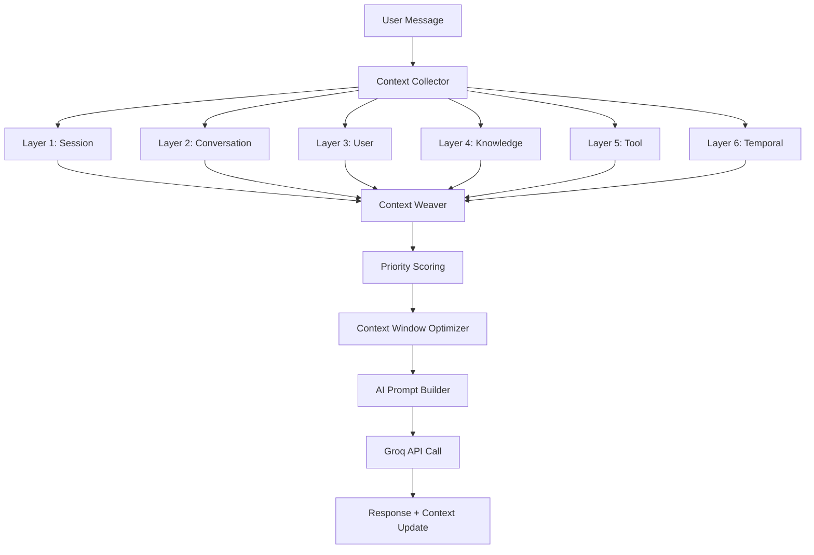

# 🧠 AI Context Management System - IntelliChat Pro

## 📋 Overview

A sophisticated **6-layer context management system** designed to provide AI with comprehensive understanding of user interactions, preferences, and conversation history. This system ensures intelligent, personalized, and contextually-aware responses while optimizing performance and memory usage.

---

## 🏗️ Context Architecture

### 🎯 **6-Layer Context System**

```typescript
interface ContextArchitecture {
  layers: {
    1: "Session Context";     // Device, browser, current session
    2: "Conversation Context"; // Current topic, sentiment, flow
    3: "User Context";        // Preferences, behavior, history
    4: "Knowledge Context";   // Facts, relationships, learned info
    5: "Tool Context";        // Recent tool usage, results
    6: "Temporal Context";    // Time-based factors, events
  };
  
  priority: "Higher layer number = Higher priority";
  integration: "Dynamic context weaving for AI prompts";
  optimization: "Smart context window management";
}
```

### 🔄 **Context Flow Diagram**



---

## 📊 Layer-by-Layer Breakdown

### 🔷 **Layer 1: Session Context**
```typescript
interface SessionContext {
  purpose: "Immediate session awareness";
  duration: "Current session only";
  priority: 1;
  
  data: {
    deviceInfo: {
      platform: string;      // "Windows", "macOS", "mobile"
      browser: string;        // "Chrome", "Firefox", "Safari"
      screenSize: string;     // "desktop", "tablet", "mobile"
      language: string;       // "en-US", "es-ES", etc.
      timezone: string;       // "America/New_York"
    };
    
    sessionMetrics: {
      startTime: Date;
      duration: number;       // Minutes active
      pageViews: number;
      interactions: number;
      messagesInSession: number;
    };
    
    currentState: {
      isActive: boolean;
      lastActivity: Date;
      currentPage: string;
      focusState: "focused" | "blurred" | "background";
    };
  };
  
  aiPromptContribution: {
    example: "User is on mobile device in EST timezone, active for 15 minutes";
    usage: "Adjust response length and complexity for mobile";
  };
}
```

### 🔷 **Layer 2: Conversation Context**
```typescript
interface ConversationContext {
  purpose: "Current conversation awareness";
  duration: "Current conversation lifecycle";
  priority: 2;
  
  data: {
    conversationFlow: {
      currentTopic: string;           // "JavaScript debugging"
      topicHistory: string[];         // Previous topics in order
      topicTransitions: TopicTransition[];
      conversationDepth: number;      // 1-10 complexity scale
    };
    
    sentimentAnalysis: {
      currentSentiment: number;       // -1 to 1 (negative to positive)
      sentimentHistory: SentimentPoint[];
      frustrationLevel: number;       // 0-1 scale
      satisfactionLevel: number;      // 0-1 scale
    };
    
    conversationStyle: {
      formalityLevel: "casual" | "formal" | "technical";
      questioningPattern: "direct" | "exploratory" | "clarifying";
      responsePreference: "concise" | "detailed" | "examples";
    };
    
    messageMetrics: {
      totalMessages: number;
      avgMessageLength: number;
      avgResponseTime: number;
      userEngagement: number;         // 0-1 scale
    };
  };
  
  aiPromptContribution: {
    example: "Conversation about React hooks, user seems frustrated with useEffect, prefers detailed examples";
    usage: "Provide extra detail and patience in React explanations";
  };
}
```

### 🔷 **Layer 3: User Context**
```typescript
interface UserContext {
  purpose: "User-specific personalization";
  duration: "Persistent across sessions";
  priority: 3;
  
  data: {
    userProfile: {
      expertiseLevel: "beginner" | "intermediate" | "expert";
      primaryDomains: string[];       // ["web-dev", "data-science"]
      learningStyle: "visual" | "textual" | "hands-on" | "theoretical";
      communicationStyle: "direct" | "supportive" | "challenging";
    };
    
    preferences: {
      responseLength: "short" | "medium" | "long";
      codeExamples: boolean;
      stepByStep: boolean;
      analogies: boolean;
      visualAids: boolean;
    };
    
    behaviorPatterns: {
      commonQuestions: string[];
      typicalWorkflow: string[];
      problemSolvingApproach: string;
      helpSeekingPattern: string;
    };
    
    historicalData: {
      totalConversations: number;
      avgSessionLength: number;
      mostDiscussedTopics: TopicFrequency[];
      successfulResolutions: number;
      satisfactionRating: number;     // Average 1-5 stars
    };
  };
  
  aiPromptContribution: {
    example: "Expert JavaScript developer, prefers concise explanations with code examples, often works with React";
    usage: "Skip basic concepts, focus on advanced patterns and best practices";
  };
}
```

### 🔷 **Layer 4: Knowledge Context**
```typescript
interface KnowledgeContext {
  purpose: "Learned facts and relationships";
  duration: "Long-term persistent";
  priority: 4;
  
  data: {
    factualKnowledge: {
      userFacts: KnowledgeFact[];     // "User works at Company X"
      projectFacts: KnowledgeFact[];  // "User building e-commerce site"
      technicalFacts: KnowledgeFact[]; // "User's stack: Node.js, React"
      personalFacts: KnowledgeFact[];  // "User prefers dark mode"
    };
    
    relationships: {
      conceptConnections: Relationship[]; // React → hooks → useEffect
      projectRelations: Relationship[];   // Project A uses Library B
      preferenceLinks: Relationship[];    // Likes X → Might like Y
    };
    
    inferredKnowledge: {
      skillLevel: SkillAssessment[];      // Per technology/domain
      interests: InterestMapping[];
      goals: GoalTracking[];
      challenges: ChallengePattern[];
    };
    
    contextualMemory: {
      importantMoments: ConversationHighlight[];
      resolutionPatterns: SolutionPattern[];
      learningProgress: ProgressTracking[];
    };
  };
  
  aiPromptContribution: {
    example: "User is building a React e-commerce app, previously struggled with state management, uses TypeScript";
    usage: "Reference previous solutions, build on established knowledge";
  };
}
```

### 🔷 **Layer 5: Tool Context**
```typescript
interface ToolContext {
  purpose: "Tool usage patterns and results";
  duration: "Session + recent history";
  priority: 5;
  
  data: {
    recentToolUsage: {
      toolName: string;
      parameters: Record<string, any>;
      result: any;
      success: boolean;
      timestamp: Date;
      userSatisfaction?: number;      // 1-5 rating
    }[];
    
    toolPreferences: {
      frequentlyUsed: string[];       // ["web_search", "calculator"]
      preferredParams: ToolParamPrefs[];
      avoidedTools: string[];         // Tools user doesn't want
    };
    
    toolEffectiveness: {
      successRate: ToolSuccessRate[]; // Per tool
      avgExecutionTime: ToolTiming[];
      userRatings: ToolRating[];
    };
    
    toolChains: {
      commonSequences: ToolSequence[]; // search → analyze → summarize
      workflowPatterns: WorkflowPattern[];
    };
  };
  
  aiPromptContribution: {
    example: "Recently used web search for React documentation, prefers code examples from searches";
    usage: "Suggest similar tools, reference recent search results";
  };
}
```

### 🔷 **Layer 6: Temporal Context**
```typescript
interface TemporalContext {
  purpose: "Time-based contextual factors";
  duration: "Dynamic based on relevance";
  priority: 6;
  
  data: {
    timeFactors: {
      currentTime: Date;
      timeOfDay: "morning" | "afternoon" | "evening" | "night";
      dayOfWeek: string;
      isWeekend: boolean;
      timezone: string;
      workingHours: boolean;
    };
    
    seasonalContext: {
      season: "spring" | "summer" | "fall" | "winter";
      holidays: string[];             // Current/upcoming holidays
      academicPeriod?: "semester" | "break" | "exams";
    };
    
    recentEvents: {
      event: string;                  // "Major React update released"
      relevance: number;              // 0-1 scale
      impact: "low" | "medium" | "high";
      timestamp: Date;
    }[];
    
    workPatterns: {
      typicalActiveHours: TimeRange[];
      workdayPattern: ActivityPattern[];
      weekendPattern: ActivityPattern[];
      productiveTimeSlots: TimeSlot[];
    };
    
    contextualTiming: {
      urgencyIndicators: string[];    // "deadline", "emergency"
      timeConstraints: TimeConstraint[];
      availabilityWindow: TimeWindow;
    };
  };
  
  aiPromptContribution: {
    example: "Late evening, weekend, user typically codes during this time, React 18 just released";
    usage: "Acknowledge timing, suggest React 18 features if relevant";
  };
}
```

---

## 🔧 Context Management Engine

### 🎯 **Context Collection Pipeline**

```typescript
class ContextCollector {
  async collectAllLayers(
    userId: string,
    sessionId: string,
    conversationId: string,
    messageContent: string
  ): Promise<LayeredContext> {
    
    // Parallel context collection for performance
    const [
      sessionCtx,
      conversationCtx,
      userCtx,
      knowledgeCtx,
      toolCtx,
      temporalCtx
    ] = await Promise.all([
      this.collectSessionContext(sessionId),
      this.collectConversationContext(conversationId),
      this.collectUserContext(userId),
      this.collectKnowledgeContext(userId, messageContent),
      this.collectToolContext(userId, sessionId),
      this.collectTemporalContext()
    ]);
    
    return {
      session: sessionCtx,
      conversation: conversationCtx,
      user: userCtx,
      knowledge: knowledgeCtx,
      tool: toolCtx,
      temporal: temporalCtx,
      collectedAt: new Date(),
      messageId: generateMessageId()
    };
  }
}
```

### 🎨 **Context Weaving Algorithm**

```typescript
class ContextWeaver {
  weaveContext(layeredContext: LayeredContext, maxTokens: number): string {
    // 1. Score each context piece by relevance
    const scoredContexts = this.scoreAllContexts(layeredContext);
    
    // 2. Prioritize by layer importance and relevance
    const prioritizedContexts = this.prioritizeContexts(scoredContexts);
    
    // 3. Build context string within token limits
    const contextString = this.buildContextString(prioritizedContexts, maxTokens);
    
    // 4. Add meta-context instructions
    return this.addMetaInstructions(contextString);
  }
  
  private scoreAllContexts(layeredContext: LayeredContext): ScoredContext[] {
    const contexts: ScoredContext[] = [];
    
    // Session context scoring (utility-based)
    contexts.push({
      layer: 1,
      content: this.formatSessionContext(layeredContext.session),
      relevanceScore: this.calculateSessionRelevance(layeredContext.session),
      priority: 1,
      tokenCost: this.estimateTokens(layeredContext.session)
    });
    
    // Conversation context scoring (immediate relevance)
    contexts.push({
      layer: 2,
      content: this.formatConversationContext(layeredContext.conversation),
      relevanceScore: this.calculateConversationRelevance(layeredContext.conversation),
      priority: 2,
      tokenCost: this.estimateTokens(layeredContext.conversation)
    });
    
    // Continue for all layers...
    
    return contexts;
  }
  
  private buildContextString(contexts: ScoredContext[], maxTokens: number): string {
    let totalTokens = 0;
    const selectedContexts: string[] = [];
    
    // Start with highest priority contexts
    for (const context of contexts.sort((a, b) => b.priority - a.priority)) {
      if (totalTokens + context.tokenCost <= maxTokens) {
        selectedContexts.push(context.content);
        totalTokens += context.tokenCost;
      }
    }
    
    return this.formatFinalContext(selectedContexts);
  }
}
```

### 🚀 **Dynamic Context Optimization**

```typescript
class ContextOptimizer {
  optimizeForModel(
    context: LayeredContext,
    modelConfig: ModelConfig
  ): OptimizedContext {
    
    const optimization = {
      contextWindow: modelConfig.maxTokens * 0.7, // 70% for context
      responseWindow: modelConfig.maxTokens * 0.3, // 30% for response
      priorityWeights: this.calculatePriorityWeights(modelConfig),
      compressionLevel: this.determineCompressionLevel(context)
    };
    
    return this.applyOptimization(context, optimization);
  }
  
  private calculatePriorityWeights(model: ModelConfig): LayerWeights {
    // Adjust weights based on model capabilities
    if (model.name.includes('mixtral')) {
      return {
        session: 0.1,
        conversation: 0.3,
        user: 0.2,
        knowledge: 0.25,
        tool: 0.1,
        temporal: 0.05
      };
    }
    
    // Default weights for other models
    return {
      session: 0.15,
      conversation: 0.25,
      user: 0.2,
      knowledge: 0.2,
      tool: 0.15,
      temporal: 0.05
    };
  }
}
```

---

## 💾 Context Storage Strategy

### 🗄️ **Database Schema Design**

```typescript
// MongoDB Collections for Context Storage

// Active Session Context (Redis + MongoDB)
interface ActiveSessionContext {
  sessionId: string;
  userId?: ObjectId;
  layers: {
    session: SessionContextData;
    conversation: ConversationContextData;
    temporal: TemporalContextData;
  };
  lastUpdated: Date;
  expiresAt: Date; // TTL for cleanup
}

// Persistent User Context (MongoDB)
interface PersistentUserContext {
  userId: ObjectId;
  userProfile: UserProfileData;
  knowledgeBase: KnowledgeContextData;
  preferences: UserPreferencesData;
  behaviorPatterns: BehaviorPatternData;
  lastUpdated: Date;
}

// Conversation Context History (MongoDB)
interface ConversationContextHistory {
  conversationId: ObjectId;
  userId: ObjectId;
  contextSnapshots: ContextSnapshot[];
  topicEvolution: TopicEvolutionData;
  sentimentJourney: SentimentJourneyData;
  createdAt: Date;
  updatedAt: Date;
}

// Tool Context Analytics (MongoDB)
interface ToolContextAnalytics {
  userId: ObjectId;
  toolUsagePatterns: ToolUsageData[];
  toolPreferences: ToolPreferencesData;
  toolEffectiveness: ToolEffectivenessData;
  lastUpdated: Date;
}
```

### ⚡ **Caching Strategy**

```typescript
class ContextCacheManager {
  // Redis caching for frequently accessed context
  private cacheConfig = {
    sessionContext: { ttl: 1800 },      // 30 minutes
    conversationContext: { ttl: 3600 }, // 1 hour
    userContext: { ttl: 86400 },        // 24 hours
    knowledgeContext: { ttl: 604800 },  // 1 week
    toolContext: { ttl: 7200 },         // 2 hours
    temporalContext: { ttl: 900 }       // 15 minutes
  };
  
  async getContextLayer(
    layerType: ContextLayer,
    identifier: string
  ): Promise<ContextData | null> {
    // Try cache first
    const cacheKey = this.buildCacheKey(layerType, identifier);
    const cached = await this.redis.get(cacheKey);
    
    if (cached) {
      return JSON.parse(cached);
    }
    
    // Fallback to database
    const dbData = await this.database.getContext(layerType, identifier);
    
    if (dbData) {
      // Cache for future use
      await this.redis.setex(
        cacheKey,
        this.cacheConfig[layerType].ttl,
        JSON.stringify(dbData)
      );
    }
    
    return dbData;
  }
}
```

---

## 🔄 Context Update Mechanisms

### 📊 **Real-time Context Updates**

```typescript
class ContextUpdater {
  async updateContextFromMessage(
    userId: string,
    conversationId: string,
    message: Message,
    aiResponse: AIResponse
  ): Promise<void> {
    
    const updates = await Promise.all([
      this.updateConversationContext(conversationId, message, aiResponse),
      this.updateUserContext(userId, message),
      this.updateKnowledgeContext(userId, message, aiResponse),
      this.updateToolContext(userId, aiResponse.toolUsage),
      this.updateSessionActivity(message.sessionId)
    ]);
    
    // Emit context updates to real-time subscribers
    this.socketService.emitContextUpdate(userId, {
      conversationId,
      updates: this.summarizeUpdates(updates),
      timestamp: new Date()
    });
  }
  
  private async updateConversationContext(
    conversationId: string,
    message: Message,
    aiResponse: AIResponse
  ): Promise<ContextUpdate> {
    
    const currentContext = await this.getConversationContext(conversationId);
    
    // Topic evolution tracking
    const newTopic = await this.extractTopic(message.content);
    if (newTopic !== currentContext.currentTopic) {
      currentContext.topicHistory.push(currentContext.currentTopic);
      currentContext.currentTopic = newTopic;
    }
    
    // Sentiment analysis
    const sentiment = await this.analyzeSentiment(message.content);
    currentContext.sentimentHistory.push({
      sentiment,
      timestamp: new Date(),
      messageId: message._id
    });
    
    // Update conversation metrics
    currentContext.messageMetrics.totalMessages++;
    currentContext.messageMetrics.avgResponseTime = this.calculateAvgResponseTime(
      currentContext.messageMetrics,
      aiResponse.responseTime
    );
    
    await this.saveConversationContext(conversationId, currentContext);
    
    return { layer: 'conversation', changes: ['topic', 'sentiment', 'metrics'] };
  }
}
```

### 🧠 **Learning and Adaptation**

```typescript
class ContextLearningEngine {
  async learnFromInteraction(
    userId: string,
    interaction: UserInteraction
  ): Promise<LearningUpdate> {
    
    const learnings = {
      userPreferences: await this.updateUserPreferences(userId, interaction),
      behaviorPatterns: await this.updateBehaviorPatterns(userId, interaction),
      knowledgeBase: await this.updateKnowledgeBase(userId, interaction),
      skillAssessment: await this.updateSkillAssessment(userId, interaction)
    };
    
    return this.consolidateLearnings(learnings);
  }
  
  private async updateUserPreferences(
    userId: string,
    interaction: UserInteraction
  ): Promise<PreferenceUpdate> {
    
    // Analyze interaction patterns to infer preferences
    const preferences = {
      responseLength: this.inferResponseLengthPreference(interaction),
      explanationStyle: this.inferExplanationStyle(interaction),
      examplePreference: this.inferExamplePreference(interaction),
      formalityLevel: this.inferFormalityPreference(interaction)
    };
    
    // Update user context with new preferences
    await this.updateUserContextPreferences(userId, preferences);
    
    return { type: 'preferences', updates: preferences };
  }
  
  private async updateKnowledgeBase(
    userId: string,
    interaction: UserInteraction
  ): Promise<KnowledgeUpdate> {
    
    // Extract new facts from the interaction
    const newFacts = await this.extractFacts(interaction);
    
    // Update existing knowledge or add new knowledge
    for (const fact of newFacts) {
      await this.upsertKnowledgeFact(userId, fact);
    }
    
    // Update knowledge relationships
    const relationships = await this.extractRelationships(interaction);
    for (const relation of relationships) {
      await this.upsertKnowledgeRelationship(userId, relation);
    }
    
    return { type: 'knowledge', newFacts, relationships };
  }
}
```

---

## 🎯 Context Usage in AI Prompts

### 📝 **Prompt Engineering with Context**

```typescript
class ContextualPromptBuilder {
  buildSystemPrompt(
    baseInstructions: string,
    layeredContext: LayeredContext
  ): string {
    
    const contextSections = [
      this.buildUserPersonaSection(layeredContext.user),
      this.buildConversationStateSection(layeredContext.conversation),
      this.buildKnowledgeSection(layeredContext.knowledge),
      this.buildToolCapabilitiesSection(layeredContext.tool),
      this.buildTemporalAwarenessSection(layeredContext.temporal),
      this.buildSessionAwarenessSection(layeredContext.session)
    ].filter(Boolean);
    
    return this.combinePromptSections(baseInstructions, contextSections);
  }
  
  private buildUserPersonaSection(userContext: UserContext): string {
    if (!userContext?.userProfile) return '';
    
    const { expertiseLevel, primaryDomains, learningStyle, communicationStyle } = userContext.userProfile;
    const { responseLength, codeExamples, stepByStep } = userContext.preferences;
    
    return `
## User Profile
- Expertise: ${expertiseLevel} level in ${primaryDomains.join(', ')}
- Learning Style: ${learningStyle}
- Communication: ${communicationStyle}
- Preferences: ${responseLength} responses, ${codeExamples ? 'include' : 'avoid'} code examples, ${stepByStep ? 'provide' : 'skip'} step-by-step instructions
`.trim();
  }
  
  private buildConversationStateSection(conversationContext: ConversationContext): string {
    if (!conversationContext?.conversationFlow) return '';
    
    const { currentTopic, topicHistory, conversationDepth } = conversationContext.conversationFlow;
    const { currentSentiment, frustrationLevel } = conversationContext.sentimentAnalysis;
    
    return `
## Current Conversation
- Current Topic: ${currentTopic}
- Topic History: ${topicHistory.slice(-3).join(' → ')}
- Conversation Depth: ${conversationDepth}/10
- User Sentiment: ${this.sentimentToText(currentSentiment)} ${frustrationLevel > 0.7 ? '(frustrated)' : ''}
- Conversation Style: ${conversationContext.conversationStyle.formalityLevel}
`.trim();
  }
  
  private buildKnowledgeSection(knowledgeContext: KnowledgeContext): string {
    if (!knowledgeContext?.factualKnowledge) return '';
    
    const relevantFacts = knowledgeContext.factualKnowledge.userFacts
      .concat(knowledgeContext.factualKnowledge.projectFacts)
      .filter(fact => fact.relevanceScore > 0.6)
      .slice(0, 5);
    
    if (relevantFacts.length === 0) return '';
    
    return `
## Relevant Knowledge
${relevantFacts.map(fact => `- ${fact.fact} (confidence: ${Math.round(fact.confidence * 100)}%)`).join('\n')}
`.trim();
  }
  
  private buildToolCapabilitiesSection(toolContext: ToolContext): string {
    if (!toolContext?.recentToolUsage) return '';
    
    const recentTools = toolContext.recentToolUsage.slice(0, 3);
    const preferredTools = toolContext.toolPreferences?.frequentlyUsed || [];
    
    return `
## Tool Context
- Available Tools: web_search, calculator, code_executor, file_reader
- Recently Used: ${recentTools.map(t => t.toolName).join(', ')}
- User Prefers: ${preferredTools.join(', ')}
- Note: Use tools when they would be helpful for the user's request
`.trim();
  }
}
```

### 🎨 **Dynamic Context Injection**

```typescript
class DynamicContextInjector {
  injectContextIntoConversation(
    messages: ChatMessage[],
    layeredContext: LayeredContext,
    maxContextTokens: number
  ): ChatMessage[] {
    
    // Build system message with context
    const systemMessage = this.buildContextualSystemMessage(layeredContext);
    
    // Inject relevant context into conversation history
    const contextualMessages = this.injectRelevantContext(messages, layeredContext);
    
    // Optimize for token limits
    const optimizedMessages = this.optimizeForTokenLimit(
      [systemMessage, ...contextualMessages],
      maxContextTokens
    );
    
    return optimizedMessages;
  }
  
  private injectRelevantContext(
    messages: ChatMessage[],
    context: LayeredContext
  ): ChatMessage[] {
    
    return messages.map((message, index) => {
      // Don't modify system messages
      if (message.role === 'system') return message;
      
      // Inject context for user messages based on relevance
      if (message.role === 'user') {
        const relevantContext = this.findRelevantContextForMessage(message, context);
        if (relevantContext) {
          return {
            ...message,
            content: this.enhanceMessageWithContext(message.content, relevantContext)
          };
        }
      }
      
      return message;
    });
  }
  
  private enhanceMessageWithContext(
    originalContent: string,
    relevantContext: RelevantContext
  ): string {
    
    // Add context hints that don't change the user's intent
    const contextHints = [];
    
    if (relevantContext.previousWork) {
      contextHints.push(`[Context: Previously worked on ${relevantContext.previousWork}]`);
    }
    
    if (relevantContext.currentProject) {
      contextHints.push(`[Context: Current project involves ${relevantContext.currentProject}]`);
    }
    
    if (relevantContext.urgency) {
      contextHints.push(`[Context: ${relevantContext.urgency}]`);
    }
    
    return contextHints.length > 0
      ? `${contextHints.join(' ')}\n\n${originalContent}`
      : originalContent;
  }
}
```

---

## 📊 Context Analytics & Insights

### 📈 **Context Effectiveness Tracking**

```typescript
class ContextAnalytics {
  async analyzeContextEffectiveness(
    userId: string,
    timeRange: DateRange
  ): Promise<ContextEffectivenessReport> {
    
    const metrics = await this.gatherMetrics(userId, timeRange);
    
    return {
      overallScore: this.calculateOverallEffectiveness(metrics),
      layerAnalysis: {
        session: this.analyzeLayerEffectiveness('session', metrics),
        conversation: this.analyzeLayerEffectiveness('conversation', metrics),
        user: this.analyzeLayerEffectiveness('user', metrics),
        knowledge: this.analyzeLayerEffectiveness('knowledge', metrics),
        tool: this.analyzeLayerEffectiveness('tool', metrics),
        temporal: this.analyzeLayerEffectiveness('temporal', metrics)
      },
      improvements: this.suggestImprovements(metrics),
      insights: this.generateInsights(metrics)
    };
  }
  
  private async gatherMetrics(
    userId: string,
    timeRange: DateRange
  ): Promise<ContextMetrics> {
    
    const conversations = await this.getConversationsInRange(userId, timeRange);
    
    return {
      totalConversations: conversations.length,
      avgSatisfactionRating: this.calculateAvgSatisfaction(conversations),
      contextRelevanceScores: this.calculateRelevanceScores(conversations),
      responseAccuracy: this.calculateResponseAccuracy(conversations),
      userEngagement: this.calculateEngagementMetrics(conversations),
      contextUtilization: this.calculateContextUtilization(conversations),
      performanceMetrics: this.calculatePerformanceMetrics(conversations)
    };
  }
}
```

### 🎯 **Context Optimization Recommendations**

```typescript
class ContextOptimizationEngine {
  async generateOptimizationRecommendations(
    userId: string
  ): Promise<OptimizationRecommendations> {
    
    const analysis = await this.analyzeUserContextPatterns(userId);
    
    return {
      contextLayerAdjustments: this.recommendLayerAdjustments(analysis),
      personalizationImprovements: this.recommendPersonalizations(analysis),
      performanceOptimizations: this.recommendPerformanceImprovements(analysis),
      knowledgeGaps: this.identifyKnowledgeGaps(analysis),
      automationOpportunities: this.identifyAutomationOpportunities(analysis)
    };
  }
  
  private recommendLayerAdjustments(analysis: UserContextAnalysis): LayerAdjustments {
    const adjustments: LayerAdjustments = {};
    
    // Analyze which layers provide most value
    if (analysis.conversationLayerEffectiveness < 0.7) {
      adjustments.conversation = {
        recommendation: "Improve topic tracking and sentiment analysis",
        priority: "high",
        impact: "Better conversation flow and personalization"
      };
    }
    
    if (analysis.knowledgeLayerUtilization < 0.5) {
      adjustments.knowledge = {
        recommendation: "Enhance knowledge extraction and fact correlation",
        priority: "medium",
        impact: "More personalized and context-aware responses"
      };
    }
    
    return adjustments;
  }
}
```

---

## 🚀 Future-Proofing Strategies

### 🔮 **Adaptive Context Evolution**

```typescript
interface FutureProofingStrategies {
  modelAdaptability: {
    strategy: "Context format adapts to new AI models";
    implementation: "Pluggable context formatters";
    benefits: ["Easy model upgrades", "Format compatibility"];
  };
  
  scalabilityPreparation: {
    strategy: "Horizontal scaling of context processing";
    implementation: "Microservice context architecture";
    benefits: ["Handle millions of users", "Independent scaling"];
  };
  
  privacyEvolution: {
    strategy: "Privacy-preserving context management";
    implementation: "Federated learning, local context";
    benefits: ["GDPR compliance", "User data control"];
  };
  
  multimodalContext: {
    strategy: "Support for voice, image, video context";
    implementation: "Extensible context layer system";
    benefits: ["Rich interaction context", "Future modal support"];
  };
  
  contextSharing: {
    strategy: "Team and organizational context sharing";
    implementation: "Hierarchical context inheritance";
    benefits: ["Team knowledge", "Organizational learning"];
  };
}
```

### 🎯 **Context Evolution Roadmap**

```typescript
const contextEvolutionRoadmap = {
  phase1: {
    duration: "Months 1-3",
    focus: "Core 6-layer system implementation",
    deliverables: [
      "Basic context collection and storage",
      "Simple context weaving for AI prompts",
      "User preference learning",
      "Performance optimization"
    ]
  },
  
  phase2: {
    duration: "Months 4-6",
    focus: "Advanced context intelligence",
    deliverables: [
      "Sophisticated knowledge graph",
      "Predictive context pre-loading",
      "Cross-conversation knowledge transfer",
      "Advanced personalization algorithms"
    ]
  },
  
  phase3: {
    duration: "Months 7-12",
    focus: "Context ecosystem and sharing",
    deliverables: [
      "Team context sharing",
      "Context marketplace for custom layers",
      "Advanced analytics and insights",
      "Multi-modal context support"
    ]
  },
  
  phase4: {
    duration: "Year 2+",
    focus: "AI-driven context management",
    deliverables: [
      "Self-optimizing context systems",
      "Federated context learning",
      "Context-aware AI model training",
      "Enterprise context platforms"
    ]
  }
};
```

---

This comprehensive context management system ensures that your ChatGPT clone will have sophisticated, intelligent, and adaptive context awareness that improves with every interaction, providing users with increasingly personalized and effective AI assistance. The system is designed to be scalable, maintainable, and future-proof for long-term success.