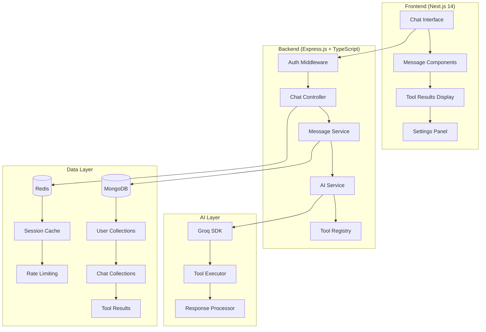
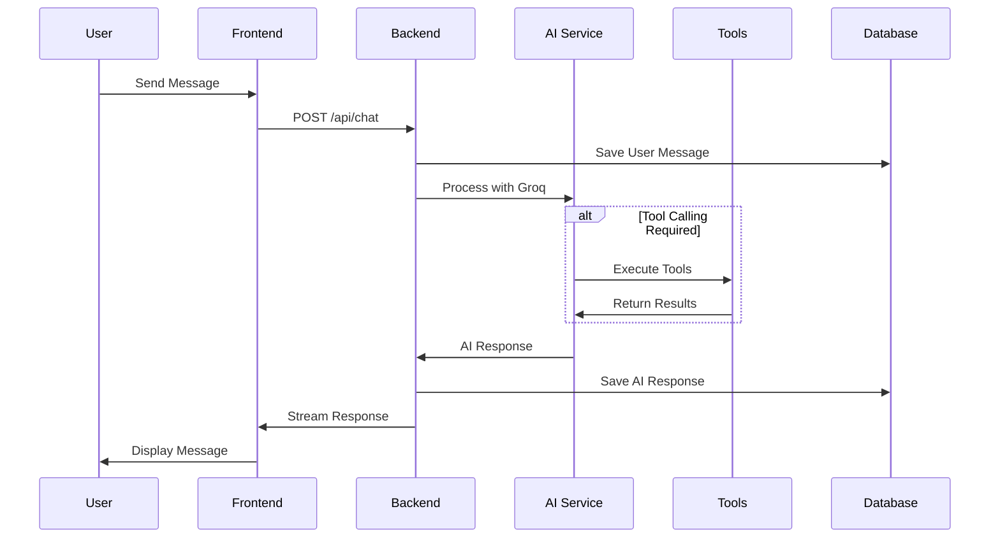
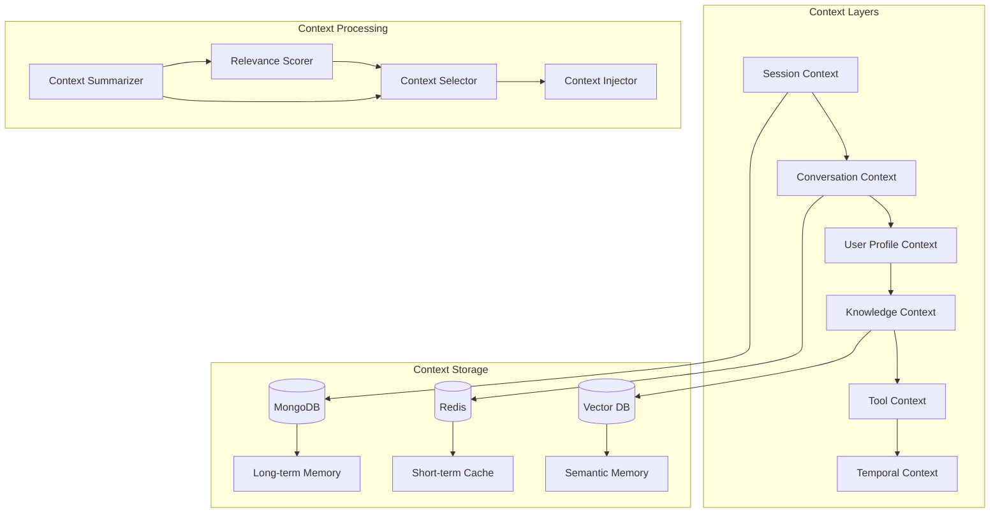

# 🚀 ChatGPT Clone - Complete Project Brief

## 📋 Project Overview

**Project Name**: IntelliChat Pro
**Version**: 1.0.0
**Target Launch**: Q1 2026
**Technology Stack**: Next.js 14 + TypeScript + Express.js + MongoDB + Groq AI + Redis

### 🎯 Project Vision
Build a production-ready ChatGPT clone with modern UI/UX, advanced AI capabilities, and enterprise-grade scalability. The platform will leverage Groq's lightning-fast inference with a comprehensive tool ecosystem.

---

## 🔍 Current Code Analysis

### ✅ **Strengths in Current Implementation**
1. **Modular Tool System**: Well-structured tool registry with expandable architecture
2. **Groq Integration**: Proper implementation of chat completions with tool calling
3. **Session Tracking**: Good analytics with token usage and performance metrics
4. **Error Handling**: Comprehensive error management in API calls
5. **Environment Management**: Proper secrets handling with dotenv

### 🔧 **Areas for Enhancement**
1. **No Persistent Storage**: Currently in-memory, needs database integration
2. **Single User Session**: No multi-user support or authentication
3. **CLI Interface**: Needs web UI for better user experience
4. **Limited Tools**: Only web search available, needs expansion
5. **No Message History**: No conversation persistence

---

## 🏗️ System Architecture & Design

### 🌐 **High-Level Architecture**



### 🔄 **Data Flow Architecture**



---

## 💻 Technical Stack Deep Dive

### 🎨 **Frontend Stack**

**Next.js 14 with App Router**
```json
{
  "framework": "Next.js 14",
  "language": "TypeScript",
  "styling": "Tailwind CSS + Shadcn/ui",
  "state": "Zustand + React Query",
  "realtime": "Socket.io Client",
  "icons": "Lucide React + Heroicons"
}
```

**Key Dependencies**:
```json
{
  "next": "^14.2.0",
  "@types/node": "^20.0.0",
  "typescript": "^5.0.0",
  "tailwindcss": "^3.4.0",
  "@radix-ui/react-*": "^1.0.0",
  "shadcn/ui": "latest",
  "zustand": "^4.5.0",
  "@tanstack/react-query": "^5.0.0",
  "socket.io-client": "^4.7.0",
  "framer-motion": "^11.0.0",
  "react-markdown": "^9.0.0",
  "react-syntax-highlighter": "^15.5.0"
}
```

### ⚙️ **Backend Stack**

**Express.js with TypeScript**
```json
{
  "framework": "Express.js",
  "language": "TypeScript",
  "validation": "Zod",
  "auth": "JWT + Passport.js",
  "realtime": "Socket.io",
  "documentation": "Swagger/OpenAPI",
  "monitoring": "Prometheus + Grafana"
}
```

**Key Dependencies**:
```json
{
  "express": "^4.19.0",
  "typescript": "^5.0.0",
  "@types/express": "^4.17.0",
  "groq-sdk": "^0.33.0",
  "mongoose": "^8.0.0",
  "redis": "^4.6.0",
  "jsonwebtoken": "^9.0.0",
  "passport": "^0.7.0",
  "passport-jwt": "^4.0.0",
  "zod": "^3.22.0",
  "winston": "^3.11.0",
  "helmet": "^7.0.0",
  "cors": "^2.8.5",
  "express-rate-limit": "^7.0.0",
  "socket.io": "^4.7.0",
  "compression": "^1.7.4",
  "express-validator": "^7.0.0"
}
```

### 🗄️ **Database Design**

**MongoDB Collections Schema**:

```typescript
// User Schema
interface User {
  _id: ObjectId;
  email: string;
  username: string;
  passwordHash: string;
  profile: {
    firstName: string;
    lastName: string;
    avatar?: string;
    preferences: {
      theme: 'light' | 'dark' | 'system';
      language: string;
      timezone: string;
    };
  };
  subscription: {
    plan: 'free' | 'pro' | 'enterprise';
    tokensUsed: number;
    tokensLimit: number;
    resetDate: Date;
  };
  createdAt: Date;
  updatedAt: Date;
  lastLoginAt: Date;
}

// Conversation Schema
interface Conversation {
  _id: ObjectId;
  userId: ObjectId;
  title: string;
  settings: {
    model: string;
    temperature: number;
    maxTokens: number;
    systemPrompt?: string;
  };
  metadata: {
    totalMessages: number;
    totalTokens: number;
    lastActivity: Date;
    tags: string[];
  };
  createdAt: Date;
  updatedAt: Date;
  archived: boolean;
}

// Message Schema
interface Message {
  _id: ObjectId;
  conversationId: ObjectId;
  role: 'user' | 'assistant' | 'system' | 'tool';
  content: string;
  metadata: {
    tokens: number;
    model?: string;
    toolCalls?: ToolCall[];
    processingTime?: number;
    error?: string;
  };
  createdAt: Date;
  edited: boolean;
  editHistory: MessageEdit[];
}

// Tool Result Schema
interface ToolResult {
  _id: ObjectId;
  messageId: ObjectId;
  toolName: string;
  input: any;
  output: any;
  executionTime: number;
  success: boolean;
  error?: string;
  createdAt: Date;
}

// Context-Specific Schemas for Advanced Memory Management

// Conversation Context Schema
interface ConversationContext {
  _id: ObjectId;
  conversationId: ObjectId;
  
  // Context summaries at different levels
  contextSummaries: {
    short: string;      // Last 10 messages
    medium: string;     // Last 50 messages  
    long: string;       // Entire conversation
    lastUpdated: Date;
  };
  
  // Extracted knowledge
  topics: Topic[];
  facts: Fact[];
  decisions: Decision[];
  actionItems: ActionItem[];
  
  // User behavior patterns in this conversation
  userPreferences: {
    responseStyle: 'detailed' | 'concise' | 'technical' | 'casual';
    preferredTools: string[];
    communicationPattern: string;
  };
  
  // Semantic memory (vector embeddings)
  semanticMemory: {
    conceptEmbeddings: Float32Array[];
    keyPhrases: string[];
    semanticGraph: SemanticNode[];
  };
  
  createdAt: Date;
  updatedAt: Date;
}

// User Context Schema
interface UserGlobalContext {
  _id: ObjectId;
  userId: ObjectId;
  
  // Cross-conversation learning
  globalPreferences: {
    communicationStyle: string;
    expertiseAreas: string[];
    preferredResponseLength: number;
    toolUsagePatterns: ToolUsagePattern[];
  };
  
  // User knowledge mapping
  knownConcepts: {
    concept: string;
    confidenceLevel: number; // 0-1
    lastMentioned: Date;
    contexts: string[]; // Where this was learned
  }[];
  
  // Behavioral patterns
  behaviorProfile: {
    activeHours: number[]; // 0-23 hour preferences
    sessionDuration: number; // Average session length
    responsePreferences: ResponsePreference[];
    topicProgression: TopicFlow[];
  };
  
  // Personal context
  personalContext: {
    role: string;
    industry: string;
    currentProjects: Project[];
    goals: Goal[];
    challenges: Challenge[];
  };
  
  createdAt: Date;
  updatedAt: Date;
}

// Knowledge Context Schema
interface KnowledgeContext {
  _id: ObjectId;
  
  // Dynamic knowledge updates
  knowledgeBase: {
    domain: string;
    concepts: KnowledgeConcept[];
    relationships: ConceptRelationship[];
    lastUpdated: Date;
    sources: KnowledgeSource[];
  }[];
  
  // Tool-generated knowledge
  toolKnowledge: {
    toolName: string;
    generatedKnowledge: any;
    reliability: number; // 0-1
    createdAt: Date;
    usageCount: number;
  }[];
  
  // Cached search results with semantic indexing
  searchCache: {
    query: string;
    queryEmbedding: Float32Array;
    results: any;
    relevanceScore: number;
    expiresAt: Date;
  }[];
  
  createdAt: Date;
  updatedAt: Date;
}

// Tool Context Schema
interface ToolContext {
  _id: ObjectId;
  userId: ObjectId;
  
  // Tool usage intelligence
  toolUsagePatterns: {
    toolName: string;
    usageFrequency: number;
    successRate: number;
    averageExecutionTime: number;
    preferredParameters: any;
    commonUseCases: string[];
  }[];
  
  // Tool result caching and learning
  intelligentCache: {
    toolName: string;
    inputHash: string;
    cachedResult: any;
    hitCount: number;
    lastUsed: Date;
    relevanceScore: number;
  }[];
  
  // Tool chain intelligence
  successfulChains: {
    toolSequence: string[];
    context: string;
    successRate: number;
    averageTime: number;
    lastUsed: Date;
  }[];
  
  createdAt: Date;
  updatedAt: Date;
}

// Context Analytics Schema
interface ContextAnalytics {
  _id: ObjectId;
  userId: ObjectId;
  timeWindow: 'daily' | 'weekly' | 'monthly';
  
  // Context effectiveness metrics
  metrics: {
    averageResponseQuality: number;
    contextRelevanceScore: number;
    userSatisfactionScore: number;
    contextProcessingTime: number;
    tokenEfficiency: number;
  };
  
  // Usage patterns
  patterns: {
    mostEffectiveContextTypes: string[];
    optimalContextSize: number;
    peakUsageHours: number[];
    commonContextQueries: string[];
  };
  
  // Optimization insights
  optimizations: {
    suggestedImprovements: string[];
    contextCompressionOpportunities: number;
    cachingEffectiveness: number;
    predictionAccuracy: number;
  };
  
  createdAt: Date;
}
```

**Redis Caching Strategy**:
```typescript
interface CacheStrategy {
  sessions: "user:session:{userId}"; // 24 hours
  conversations: "conv:list:{userId}"; // 1 hour
  rateLimits: "rate:{userId}:{endpoint}"; // 1 hour
  activeUsers: "active:users"; // Real-time set
  toolResults: "tool:cache:{hash}"; // 6 hours
  
  // Context-specific caching
  contextSummaries: "context:summary:{conversationId}"; // 12 hours
  userContext: "user:context:{userId}"; // 6 hours
  semanticCache: "semantic:cache:{queryHash}"; // 24 hours
  toolChains: "tool:chains:{userId}"; // 48 hours
  knowledgeGraph: "knowledge:graph:{domain}"; // 7 days
}
```

---

## 🛠️ AI Integration & Tools Ecosystem

### 🤖 **Groq Integration Strategy**

```typescript
interface GroqConfig {
  models: {
    default: "openai/gpt-oss-120b";
    fast: "llama-3.1-8b-instant";
    creative: "mixtral-8x7b-32768";
    coding: "openai/gpt-oss-120b";
  };
  parameters: {
    temperature: 0.7;
    maxTokens: 4096;
    topP: 1;
    frequencyPenalty: 0;
    presencePenalty: 0;
  };
  streaming: true;
  tools: ToolRegistry;
}
```

### 🧰 **Comprehensive Tool Registry**

```typescript
interface ToolRegistry {
  // Search & Information
  searchWeb: WebSearchTool;
  searchImages: ImageSearchTool;
  searchNews: NewsSearchTool;
  
  // Development
  codeExecutor: CodeExecutionTool;
  githubIntegration: GitHubTool;
  packageSearch: NPMSearchTool;
  
  // Productivity
  calendar: CalendarTool;
  emailSender: EmailTool;
  documentGenerator: DocumentTool;
  
  // Data & Analytics
  chartGenerator: ChartTool;
  dataAnalysis: DataAnalysisTool;
  excelProcessor: ExcelTool;
  
  // Creative
  imageGenerator: ImageGenTool;
  musicGenerator: MusicTool;
  videoSummarizer: VideoSummaryTool;
  
  // Business
  currencyConverter: CurrencyTool;
  stockData: StockTool;
  weatherInfo: WeatherTool;
  
  // Indian Specific
  upiValidator: UPITool;
  indianRailways: IRCTCTool;
  gstCalculator: GSTTool;
  indianMarkets: NSETool;
}
```

### 📊 **Tool Implementation Example**

```typescript
// Enhanced Web Search Tool
export class WebSearchTool implements AITool {
  name = "searchWeb";
  description = "Search the web for current information";
  
  schema = {
    type: "function",
    function: {
      name: "searchWeb",
      description: "Search web for latest information on any topic",
      parameters: {
        type: "object",
        properties: {
          query: { type: "string", description: "Search query" },
          region: { type: "string", enum: ["global", "india", "us"], default: "india" },
          timeRange: { type: "string", enum: ["day", "week", "month", "year"], default: "week" },
          category: { type: "string", enum: ["general", "news", "tech", "finance"] }
        },
        required: ["query"]
      }
    }
  };

  async execute(params: WebSearchParams): Promise<ToolResult> {
    const startTime = Date.now();
    
    try {
      const searchResults = await this.tavilyClient.search({
        query: params.query,
        searchDepth: "advanced",
        maxResults: 10,
        includeImages: false,
        includeAnswer: true
      });

      const enrichedResults = await this.enrichResults(searchResults, params);
      
      return {
        success: true,
        data: enrichedResults,
        executionTime: Date.now() - startTime,
        metadata: {
          resultCount: searchResults.results.length,
          region: params.region,
          cached: false
        }
      };
    } catch (error) {
      return {
        success: false,
        error: error.message,
        executionTime: Date.now() - startTime
      };
    }
  }
}
```

---

## 🧠 Advanced Context Management System

### 🎯 **Context Strategy Overview**

Context management is the heart of making our ChatGPT clone truly intelligent. We need multiple layers of context to create seamless, intelligent conversations that feel natural and maintain continuity.



### 🏗️ **Context Architecture Design**

```typescript
interface ContextManager {
  // Core context types
  sessionContext: SessionContext;
  conversationContext: ConversationContext;
  userContext: UserContext;
  knowledgeContext: KnowledgeContext;
  toolContext: ToolContext;
  temporalContext: TemporalContext;
  
  // Context operations
  buildContext(conversationId: string, messageId?: string): Promise<ContextBundle>;
  updateContext(context: Partial<ContextBundle>): Promise<void>;
  summarizeContext(messages: Message[]): Promise<ContextSummary>;
  selectRelevantContext(query: string, availableContext: ContextBundle): ContextBundle;
}
```

### 📋 **Context Types & Implementation**

#### 1. **Session Context** - Immediate conversation state

```typescript
interface SessionContext {
  conversationId: string;
  userId: string;
  sessionId: string;
  startTime: Date;
  lastActivity: Date;
  
  // Current conversation state
  currentTopic: string;
  conversationFlow: ConversationFlow[];
  userIntent: UserIntent;
  
  // Active context
  activeTools: string[];
  pendingActions: PendingAction[];
  contextWindow: Message[]; // Last N messages
  
  // User state
  userMood: 'helpful' | 'frustrated' | 'curious' | 'urgent';
  preferredResponseStyle: 'detailed' | 'concise' | 'technical' | 'casual';
  
  // Memory management
  tokenUsage: TokenUsage;
  memoryPressure: number; // 0-1, how much context to keep
}
```

#### 2. **Conversation Context** - Long-term conversation memory

```typescript
interface ConversationContext {
  conversationId: string;
  
  // Conversation metadata
  title: string;
  createdAt: Date;
  lastMessage: Date;
  messageCount: number;
  
  // Conversation summary
  mainTopics: Topic[];
  keyDecisions: Decision[];
  importantFacts: Fact[];
  actionItems: ActionItem[];
  
  // Conversation patterns
  userPreferences: ConversationPreference[];
  communicationStyle: CommunicationStyle;
  topicProgression: TopicFlow[];
  
  // Context evolution
  contextSummaries: ContextSummary[]; // Periodic summaries
  importantMoments: ImportantMoment[]; // Key conversation points
  
  // Smart memory
  semanticMemory: SemanticMemory; // Vector embeddings of key concepts
  proceduralMemory: ProceduralMemory; // How user likes things done
  episodicMemory: EpisodicMemory; // Specific events and references
}
```

#### 3. **User Profile Context** - Cross-conversation user understanding

```typescript
interface UserContext {
  userId: string;
  
  // User profile
  profile: {
    name: string;
    role: string; // developer, designer, manager, etc.
    expertise: string[]; // areas of knowledge
    location: string;
    timezone: string;
    language: string;
  };
  
  // User behavior patterns
  behaviorPatterns: {
    preferredTopics: string[];
    commonQuestions: string[];
    toolUsagePatterns: ToolUsagePattern[];
    timePatterns: TimePattern[];
    responsePreferences: ResponsePreference[];
  };
  
  // User knowledge & context
  knownConcepts: Concept[];
  projectContext: ProjectContext[];
  workContext: WorkContext;
  personalContext: PersonalContext;
  
  // Learning & adaptation
  learningProfile: LearningProfile;
  feedbackHistory: FeedbackHistory[];
  adaptationRules: AdaptationRule[];
  
  // Privacy & preferences
  privacySettings: PrivacySettings;
  customInstructions: string;
  communicationPreferences: CommunicationPreferences;
}
```

#### 4. **Knowledge Context** - Domain-specific intelligence

```typescript
interface KnowledgeContext {
  // Dynamic knowledge base
  recentUpdates: KnowledgeUpdate[];
  domainKnowledge: DomainKnowledge[];
  conceptGraph: ConceptGraph;
  
  // Contextual knowledge retrieval
  relevantConcepts: RelevantConcept[];
  relatedTopics: RelatedTopic[];
  backgroundContext: BackgroundContext[];
  
  // Knowledge sources
  toolResults: ToolResult[];
  webSearchContext: WebSearchContext[];
  documentContext: DocumentContext[];
  codeContext: CodeContext[];
  
  // Knowledge validation
  factChecking: FactCheck[];
  sourceCredibility: SourceCredibility[];
  knowledgeRecency: KnowledgeRecency[];
}
```

#### 5. **Tool Context** - Smart tool usage and results

```typescript
interface ToolContext {
  // Tool execution history
  recentToolCalls: ToolCall[];
  toolResults: ToolResult[];
  toolPerformance: ToolPerformance[];
  
  // Tool intelligence
  toolUsagePatterns: ToolUsagePattern[];
  successfulToolChains: ToolChain[];
  toolPreferences: ToolPreference[];
  
  // Result management
  cachedResults: CachedToolResult[];
  resultRelevance: ResultRelevance[];
  resultFreshness: ResultFreshness[];
  
  // Tool optimization
  toolRecommendations: ToolRecommendation[];
  toolChainSuggestions: ToolChainSuggestion[];
  parallelizationOpportunities: ParallelizationOpportunity[];
}
```

#### 6. **Temporal Context** - Time-aware intelligence

```typescript
interface TemporalContext {
  // Time awareness
  currentTime: Date;
  userTimezone: string;
  conversationTime: Date;
  
  // Temporal patterns
  timeBasedContext: TimeBasedContext[];
  seasonalContext: SeasonalContext[];
  eventContext: EventContext[];
  
  // Context aging
  contextDecay: ContextDecay[];
  freshnessScrores: FreshnessScore[];
  temporalRelevance: TemporalRelevance[];
  
  // Future awareness
  scheduledEvents: ScheduledEvent[];
  upcomingDeadlines: Deadline[];
  timeBasedReminders: Reminder[];
}
```

### 🔄 **Context Processing Pipeline**

```typescript
class ContextProcessor {
  async buildContextForMessage(
    conversationId: string,
    userMessage: string,
    options: ContextOptions = {}
  ): Promise<ContextBundle> {
    
    // 1. Gather all available context
    const [
      sessionCtx,
      conversationCtx,
      userCtx,
      knowledgeCtx,
      toolCtx,
      temporalCtx
    ] = await Promise.all([
      this.getSessionContext(conversationId),
      this.getConversationContext(conversationId),
      this.getUserContext(conversationId),
      this.getKnowledgeContext(userMessage),
      this.getToolContext(conversationId),
      this.getTemporalContext()
    ]);

    // 2. Analyze user intent and context needs
    const intentAnalysis = await this.analyzeUserIntent(userMessage, conversationCtx);
    
    // 3. Score context relevance
    const relevanceScores = await this.scoreContextRelevance(
      userMessage,
      intentAnalysis,
      { sessionCtx, conversationCtx, userCtx, knowledgeCtx, toolCtx, temporalCtx }
    );

    // 4. Select optimal context based on token budget
    const selectedContext = await this.selectOptimalContext(
      relevanceScores,
      options.maxTokens || 8000
    );

    // 5. Format context for AI consumption
    const formattedContext = await this.formatContextForAI(selectedContext);

    // 6. Inject dynamic context (time, tools, etc.)
    const dynamicContext = await this.injectDynamicContext(formattedContext);

    return {
      context: dynamicContext,
      metadata: {
        tokensUsed: this.countTokens(dynamicContext),
        contextSources: this.getContextSources(selectedContext),
        relevanceScores,
        processingTime: Date.now() - startTime
      }
    };
  }

  async updateContextAfterResponse(
    conversationId: string,
    userMessage: string,
    aiResponse: string,
    toolResults: ToolResult[]
  ): Promise<void> {
    
    // 1. Extract new context from interaction
    const newContext = await this.extractContextFromInteraction({
      userMessage,
      aiResponse,
      toolResults
    });

    // 2. Update conversation context
    await this.updateConversationContext(conversationId, {
      lastMessage: new Date(),
      newTopics: newContext.topics,
      newFacts: newContext.facts,
      userPreferences: newContext.preferences
    });

    // 3. Update user context if learning occurred
    if (newContext.userLearning.length > 0) {
      await this.updateUserContext(conversationId, newContext.userLearning);
    }

    // 4. Cache tool results for future use
    if (toolResults.length > 0) {
      await this.cacheToolResults(toolResults, newContext.cacheStrategy);
    }

    // 5. Update semantic memory with embeddings
    await this.updateSemanticMemory(conversationId, {
      userMessage,
      aiResponse,
      concepts: newContext.concepts
    });
  }
}
```

### 🎛️ **Context Configuration & Strategies**

```typescript
interface ContextStrategy {
  // Context selection strategies
  strategies: {
    'aggressive': { maxTokens: 12000, includeAll: true, priority: 'comprehensive' };
    'balanced': { maxTokens: 8000, includeAll: false, priority: 'relevant' };
    'minimal': { maxTokens: 4000, includeAll: false, priority: 'essential' };
    'speed': { maxTokens: 2000, includeAll: false, priority: 'fast' };
  };

  // Context adaptation rules
  adaptationRules: {
    userExpertise: AdaptationRule;
    conversationLength: AdaptationRule;
    topicComplexity: AdaptationRule;
    timeConstraints: AdaptationRule;
  };

  // Memory management
  memoryManagement: {
    summarizationTrigger: number; // Message count
    contextCompressionRatio: number; // 0-1
    semanticSearchThreshold: number; // 0-1
    cacheEvictionPolicy: 'LRU' | 'LFU' | 'TTL';
  };
}
```

### 🚀 **Advanced Context Features**

#### 🔍 **Smart Context Search**
```typescript
class SemanticContextSearch {
  async findRelevantContext(
    query: string,
    conversationId: string,
    options: SearchOptions
  ): Promise<RelevantContext[]> {
    
    // 1. Generate query embeddings
    const queryEmbedding = await this.embeddings.embed(query);
    
    // 2. Search across multiple context sources
    const [
      conversationResults,
      userResults,
      knowledgeResults,
      toolResults
    ] = await Promise.all([
      this.searchConversationContext(queryEmbedding, conversationId),
      this.searchUserContext(queryEmbedding, conversationId),
      this.searchKnowledgeBase(queryEmbedding),
      this.searchToolResults(queryEmbedding, conversationId)
    ]);

    // 3. Rank and merge results
    const rankedResults = this.rankContextRelevance([
      ...conversationResults,
      ...userResults,
      ...knowledgeResults,
      ...toolResults
    ]);

    return rankedResults.slice(0, options.maxResults || 10);
  }
}
```

#### 🧮 **Context Summarization**
```typescript
class ContextSummarizer {
  async summarizeConversation(
    messages: Message[],
    options: SummarizationOptions
  ): Promise<ConversationSummary> {
    
    // 1. Identify key topics and themes
    const topics = await this.extractTopics(messages);
    
    // 2. Extract important facts and decisions
    const facts = await this.extractFacts(messages);
    const decisions = await this.extractDecisions(messages);
    
    // 3. Identify user preferences and patterns
    const preferences = await this.extractUserPreferences(messages);
    
    // 4. Create hierarchical summary
    const summary = await this.groqClient.chat.completions.create({
      model: "openai/gpt-oss-120b",
      messages: [{
        role: "system",
        content: `Create a comprehensive conversation summary focusing on:
        1. Main topics discussed
        2. Key decisions made
        3. Important facts established
        4. User preferences observed
        5. Action items identified`
      }, {
        role: "user",
        content: `Summarize this conversation:\n${messages.map(m => `${m.role}: ${m.content}`).join('\n')}`
      }],
      temperature: 0.3
    });

    return {
      textSummary: summary.choices[0].message.content,
      structuredData: { topics, facts, decisions, preferences },
      metadata: {
        messageCount: messages.length,
        timeSpan: this.calculateTimeSpan(messages),
        keyMoments: await this.identifyKeyMoments(messages)
      }
    };
  }
}
```

#### 🎯 **Context Personalization**
```typescript
class ContextPersonalizer {
  async personalizeContext(
    baseContext: ContextBundle,
    userProfile: UserProfile,
    conversationHistory: ConversationHistory
  ): Promise<PersonalizedContext> {
    
    // 1. Adapt to user expertise level
    const expertiseAdaptation = this.adaptToExpertise(
      baseContext,
      userProfile.expertise
    );

    // 2. Adjust for communication style
    const styleAdaptation = this.adaptToCommunicationStyle(
      expertiseAdaptation,
      userProfile.communicationStyle
    );

    // 3. Include user-specific context
    const userSpecificContext = await this.includeUserSpecificContext(
      styleAdaptation,
      userProfile,
      conversationHistory
    );

    // 4. Apply user's custom instructions
    const customizedContext = this.applyCustomInstructions(
      userSpecificContext,
      userProfile.customInstructions
    );

    return customizedContext;
  }
}
```

### 📊 **Context Analytics & Optimization**

```typescript
interface ContextAnalytics {
  // Performance metrics
  contextEffectiveness: {
    responseQuality: number; // 0-1
    userSatisfaction: number; // 0-1
    contextRelevance: number; // 0-1
    processingTime: number; // ms
  };

  // Usage patterns
  contextUsagePatterns: {
    mostUsedContextTypes: ContextType[];
    optimalContextSize: number;
    userPreferredStyles: string[];
    temporalPatterns: TemporalPattern[];
  };

  // Optimization opportunities
  optimizationOpportunities: {
    contextCompressionOpportunities: CompressionOpportunity[];
    cachingOpportunities: CachingOpportunity[];
    preloadingOpportunities: PreloadingOpportunity[];
  };
}
```

### 🔧 **Implementation Priority**

#### **Phase 1: Core Context (Week 1-2)**
- [ ] Basic session and conversation context
- [ ] Message history management
- [ ] Simple context summarization
- [ ] Token budget management

#### **Phase 2: Smart Context (Week 3-4)**
- [ ] User profile context
- [ ] Semantic search for context
- [ ] Context relevance scoring
- [ ] Dynamic context selection

#### **Phase 3: Advanced Context (Week 5-6)**
- [ ] Tool context integration
- [ ] Temporal context awareness
- [ ] Knowledge graph integration
- [ ] Context personalization

#### **Phase 4: Optimization (Week 7-8)**
- [ ] Context caching strategies
- [ ] Performance optimization
- [ ] Context analytics dashboard
- [ ] Auto-tuning algorithms

---

## 🎨 UI/UX Design System

### 🌙 **Dark Mode ChatGPT-Inspired Design**

```css
/* Color System */
:root {
  --bg-primary: #0d1117;
  --bg-secondary: #161b22;
  --bg-tertiary: #21262d;
  --text-primary: #f0f6fc;
  --text-secondary: #7c8590;
  --accent-primary: #238636;
  --accent-hover: #2ea043;
  --border-primary: #30363d;
  --border-secondary: #21262d;
}

/* Component Structure */
.chat-container {
  @apply min-h-screen bg-bg-primary text-text-primary;
}

.sidebar {
  @apply w-64 bg-bg-secondary border-r border-border-primary;
}

.chat-area {
  @apply flex-1 flex flex-col;
}

.message-container {
  @apply max-w-4xl mx-auto px-4 py-6;
}

.message-bubble {
  @apply p-4 rounded-lg mb-4 bg-bg-tertiary border border-border-primary;
}
```

### 📱 **Component Architecture**

```typescript
// Component Structure
src/
├── components/
│   ├── ui/                    // Shadcn/ui components
│   ├── chat/
│   │   ├── ChatContainer.tsx
│   │   ├── MessageList.tsx
│   │   ├── MessageBubble.tsx
│   │   ├── InputArea.tsx
│   │   ├── ToolResultDisplay.tsx
│   │   └── TypingIndicator.tsx
│   ├── sidebar/
│   │   ├── ConversationList.tsx
│   │   ├── ConversationItem.tsx
│   │   └── SidebarActions.tsx
│   ├── modals/
│   │   ├── SettingsModal.tsx
│   │   ├── ShareModal.tsx
│   │   └── ExportModal.tsx
│   └── layout/
│       ├── Header.tsx
│       ├── Sidebar.tsx
│       └── MobileNav.tsx
```

### 🎯 **Key UI Features**

1. **Real-time Streaming**: TypeScript + Server-Sent Events
2. **Syntax Highlighting**: Prism.js + custom themes
3. **Math Rendering**: KaTeX integration
4. **File Upload**: Drag & drop with progress
5. **Export Options**: PDF, Markdown, JSON
6. **Responsive Design**: Mobile-first approach
7. **Accessibility**: WCAG 2.1 compliant
8. **Animations**: Framer Motion for smooth transitions

---

## 🚀 API Design & Endpoints

### 📡 **RESTful API Structure**

```typescript
// Authentication Endpoints
POST   /api/auth/register
POST   /api/auth/login
POST   /api/auth/logout
POST   /api/auth/refresh
GET    /api/auth/profile
PUT    /api/auth/profile

// Chat Endpoints
GET    /api/conversations
POST   /api/conversations
GET    /api/conversations/:id
PUT    /api/conversations/:id
DELETE /api/conversations/:id
POST   /api/conversations/:id/messages
GET    /api/conversations/:id/messages
DELETE /api/messages/:id
PUT    /api/messages/:id

// AI Endpoints
POST   /api/ai/chat           // Main chat endpoint
POST   /api/ai/stream         // Streaming endpoint
GET    /api/ai/models         // Available models
POST   /api/ai/tools/execute  // Manual tool execution

// User Management
GET    /api/users/stats       // Usage statistics
PUT    /api/users/preferences
GET    /api/users/export      // Export user data

// Admin Endpoints (Future)
GET    /api/admin/stats
GET    /api/admin/users
POST   /api/admin/tools/manage
```

### 🔄 **WebSocket Events**

```typescript
interface SocketEvents {
  // Client to Server
  'join-conversation': (conversationId: string) => void;
  'leave-conversation': (conversationId: string) => void;
  'typing-start': (conversationId: string) => void;
  'typing-stop': (conversationId: string) => void;

  // Server to Client
  'message-chunk': (chunk: MessageChunk) => void;
  'message-complete': (message: Message) => void;
  'tool-execution-start': (toolName: string) => void;
  'tool-execution-complete': (result: ToolResult) => void;
  'conversation-updated': (conversation: Conversation) => void;
  'error': (error: ErrorEvent) => void;
}
```

---

## 🔐 Security & Performance

### 🛡️ **Security Measures**

```typescript
interface SecurityConfig {
  authentication: {
    jwt: {
      secret: string;
      expiresIn: "15m";
      refreshExpiresIn: "7d";
    };
    bcrypt: {
      rounds: 12;
    };
  };
  
  rateLimit: {
    global: "100 requests per 15 minutes";
    auth: "5 requests per 15 minutes";
    ai: "30 requests per hour";
    tools: "50 requests per hour";
  };
  
  validation: {
    messageLength: 10000;
    fileSize: "10MB";
    allowedFileTypes: ["txt", "pdf", "doc", "docx", "md"];
  };
  
  cors: {
    origin: process.env.ALLOWED_ORIGINS;
    credentials: true;
  };
}
```

### ⚡ **Performance Optimizations**

```typescript
interface PerformanceConfig {
  database: {
    mongodb: {
      indexes: [
        "userId + createdAt",
        "conversationId + createdAt",
        "userId + archived"
      ];
      aggregationPipelines: true;
    };
    redis: {
      clusterMode: true;
      persistence: "AOF";
      maxMemory: "1gb";
    };
  };
  
  caching: {
    levels: ["Redis", "CDN", "Browser"];
    strategies: ["LRU", "TTL", "Invalidation"];
  };
  
  streaming: {
    chunkSize: 1024;
    bufferSize: 8192;
    compression: "gzip";
  };
}
```

---

## 📁 Project Structure

```
intellichat-pro/
├── 📁 apps/
│   ├── 📁 web/                    # Next.js Frontend
│   │   ├── 📁 src/
│   │   │   ├── 📁 app/           # App Router
│   │   │   ├── 📁 components/    # React Components
│   │   │   ├── 📁 hooks/         # Custom Hooks
│   │   │   ├── 📁 lib/           # Utilities
│   │   │   ├── 📁 stores/        # Zustand Stores
│   │   │   └── 📁 types/         # TypeScript Types
│   │   ├── 📄 package.json
│   │   ├── 📄 next.config.js
│   │   ├── 📄 tailwind.config.js
│   │   └── 📄 tsconfig.json
│   └── 📁 api/                    # Express.js Backend
│       ├── 📁 src/
│       │   ├── 📁 controllers/   # Route Controllers
│       │   ├── 📁 middleware/    # Express Middleware
│       │   ├── 📁 models/        # MongoDB Models
│       │   ├── 📁 services/      # Business Logic
│       │   ├── 📁 tools/         # AI Tools
│       │   ├── 📁 utils/         # Utilities
│       │   ├── 📁 validators/    # Input Validation
│       │   └── 📄 server.ts      # Main Server
│       ├── 📄 package.json
│       └── 📄 tsconfig.json
├── 📁 packages/                   # Shared Libraries
│   ├── 📁 types/                 # Shared TypeScript Types
│   ├── 📁 utils/                 # Shared Utilities
│   └── 📁 config/                # Shared Configurations
├── 📁 docs/                      # Documentation
├── 📁 scripts/                   # Build Scripts
├── 📄 package.json               # Root Package.json
├── 📄 docker-compose.yml         # Development Setup
├── 📄 .env.example               # Environment Template
└── 📄 README.md                  # Project Documentation
```

---

## 🚦 Development Roadmap

### 🏁 **Phase 1: Foundation (Week 1-2)**
- [ ] Project setup with monorepo structure
- [ ] Database schema design and implementation
- [ ] Authentication system (JWT + Passport)
- [ ] Basic Express.js API with TypeScript
- [ ] Groq integration with current tool system
- [ ] Basic Next.js setup with Tailwind

### 🎨 **Phase 2: Core UI (Week 3-4)**
- [ ] ChatGPT-inspired dark theme implementation
- [ ] Chat interface with message bubbles
- [ ] Sidebar with conversation list
- [ ] Real-time streaming implementation
- [ ] Basic tool result display
- [ ] Mobile-responsive design

### 🤖 **Phase 3: AI Enhancement (Week 5-6)**
- [ ] Advanced tool registry system
- [ ] Multiple Groq model support
- [ ] Tool result caching with Redis
- [ ] Conversation memory and context
- [ ] Message editing and regeneration
- [ ] Export functionality

### 🔧 **Phase 4: Advanced Features (Week 7-8)**
- [ ] File upload and processing
- [ ] Advanced tool integrations
- [ ] User preferences and settings
- [ ] Conversation sharing
- [ ] Admin dashboard
- [ ] Performance monitoring

### 🚀 **Phase 5: Production (Week 9-10)**
- [ ] Security hardening
- [ ] Performance optimization
- [ ] Comprehensive testing
- [ ] Documentation completion
- [ ] Deployment setup
- [ ] Monitoring and logging

---

## 🛠️ Getting Started Guide

### 🔧 **Development Setup**

```bash
# 1. Clone and setup
git clone <repository>
cd intellichat-pro
npm install

# 2. Environment setup
cp .env.example .env
# Fill in your API keys and database URLs

# 3. Database setup
docker-compose up -d mongodb redis

# 4. Install dependencies
npm run install:all

# 5. Start development servers
npm run dev
```

### 📝 **Environment Variables**

```bash
# Core Configuration
NODE_ENV=development
PORT=3000
FRONTEND_URL=http://localhost:3000
API_URL=http://localhost:3001

# Database
MONGODB_URI=mongodb://localhost:27017/intellichat
REDIS_URL=redis://localhost:6379

# AI Services
GROQ_API_KEY=your_groq_api_key
GROQ_MODEL=openai/gpt-oss-120b
TAVILY_API_KEY=your_tavily_api_key

# Authentication
JWT_SECRET=your_super_secure_jwt_secret
JWT_REFRESH_SECRET=your_refresh_secret

# External APIs (Optional)
OPENAI_API_KEY=your_openai_key
ANTHROPIC_API_KEY=your_anthropic_key
GEMINI_API_KEY=your_gemini_key

# Monitoring (Production)
SENTRY_DSN=your_sentry_dsn
PROMETHEUS_ENDPOINT=your_prometheus_endpoint
```

---

## 📊 Success Metrics & KPIs

### 📈 **Technical Metrics**
- Response time: < 500ms for UI, < 2s for AI
- Uptime: 99.9%
- Database query time: < 100ms
- Tool execution time: < 5s average
- Memory usage: < 512MB per user session

### 👥 **User Experience Metrics**
- Message completion rate: > 95%
- Tool success rate: > 90%
- User retention: > 70% (7-day)
- Session duration: > 10 minutes average
- Feature adoption: > 60% tool usage

### 💰 **Business Metrics**
- API cost per message: < ₹0.50
- Infrastructure cost: < ₹10,000/month
- User acquisition cost: < ₹500
- Monthly active users: 1000+ (Month 3)
- Conversion rate: 15% (free to paid)

---

## 🎯 Conclusion

This comprehensive project brief provides a roadmap for building a production-ready ChatGPT clone that leverages your existing Groq integration while adding modern web technologies, scalable architecture, and a comprehensive tool ecosystem.

**Key Differentiators:**
- ⚡ **Lightning-fast inference** with Groq
- 🛠️ **Extensive tool ecosystem** (20+ tools)
- 🇮🇳 **India-focused features** (UPI, IRCTC, GST, etc.)
- 🎨 **Modern UI/UX** with ChatGPT-inspired design
- 📱 **Mobile-first approach** with responsive design
- 🔒 **Enterprise-grade security** and scalability

The project builds upon your current strengths while addressing all requirements for a modern, scalable chat application. The modular architecture ensures easy maintenance and feature additions.

**Next Steps**: Start with Phase 1 foundation work, setting up the monorepo structure and core backend services.