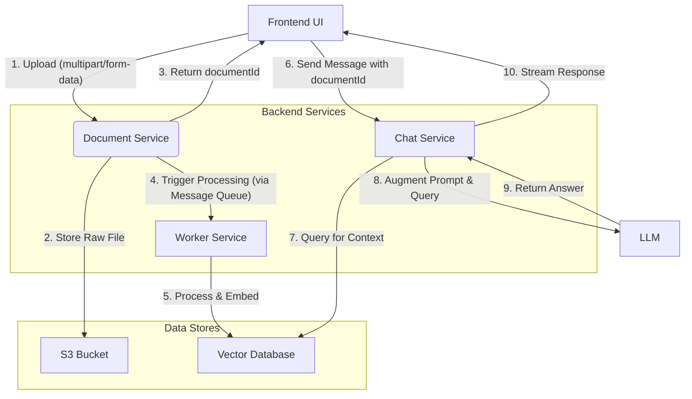

# System Design: RAG and Document Handling

This document outlines the architecture and implementation plan for integrating Retrieval-Augmented Generation (RAG) with file uploads (PDF, DOCX, images) into the IntelliChat application.

## 1. Architectural Decision: Separate Document Service

To maintain a clean and scalable architecture, we will create a dedicated **Document Service** to handle file uploads and processing, separate from the existing **Chat Service**.

### Rationale:

*   **Separation of Concerns:** The Chat Service remains optimized for real-time, JSON-based messaging, while the Document Service handles the complexities of `multipart/form-data` requests, file validation, and storage.
*   **Scalability:** File processing is resource-intensive. A separate service can be scaled independently to handle heavy loads without impacting the performance of the core chat functionality.
*   **Maintainability:** Isolating file-handling logic makes the codebase easier to develop, debug, and maintain.
*   **Security:** It allows for targeted security measures for file uploads, such as virus scanning and strict content-type validation, without complicating the chat API.

## 2. High-Level System Architecture

The diagram below illustrates the end-to-end flow of a document from upload to its use in a chat conversation.

## 3. Detailed Workflow

### Step 1: File Upload
- **Action:** The user uploads a file (PDF, DOCX, image) through the chat interface.
- **Process:** The frontend sends a `POST` request with `Content-Type: multipart/form-data` to a new endpoint: `/api/documents/upload`.

### Step 2: Initial Handling (Document Service)
- **Action:** The Document Service receives the request.
- **Process:**
    1.  It uses a middleware like **`multer`** to parse the `multipart/form-data`.
    2.  The raw file is immediately streamed to an **S3 Bucket** for persistent storage.
    3.  A new record is created in a database (e.g., MongoDB) with metadata: `{ documentId, userId, fileName, s3Url, status: 'processing' }`.
    4.  The `documentId` is returned to the frontend.

### Step 3: Asynchronous Processing (Worker Service)
- **Action:** The system processes the file to make it searchable.
- **Process:**
    1.  The Document Service publishes a message containing the `documentId` to a **Message Queue** (e.g., RabbitMQ, AWS SQS).
    2.  A separate **Worker Service** consumes the message.
    3.  The worker downloads the file from S3.
    4.  It **parses** the document to extract text (using `pdf-parse`, `mammoth.js`, or an OCR library for images).
    5.  The extracted text is **chunked** into smaller, semantically meaningful segments.
    6.  Each chunk is converted into a vector embedding using a pre-trained model.
    7.  The vectors are stored in a **Vector Database** (e.g., Pinecone, Weaviate), indexed by `documentId`.
    8.  The document's status in the database is updated to `'completed'`.

### Step 4: Chat Integration (RAG)
- **Action:** The user asks a question related to the uploaded document.
- **Process:**
    1.  The frontend sends the message to the Chat Service, including the `documentId` in the `attachments` field.
    2.  The Chat Service creates an embedding of the user's question.
    3.  It queries the **Vector Database** with the question embedding to find the most relevant text chunks from the specified document.
    4.  This relevant context is prepended to the user's original question, forming an augmented prompt.
    5.  The augmented prompt is sent to the LLM (e.g., ChatGPT).
    6.  The LLM generates a response based on the provided context, which is then streamed back to the user.

## 4. Implementation Plan

### Phase 1: Backend - Document Service & Processing
- **Task 1: Document API**
    - [ ] Create new routes at `/api/documents` (`document.routes.ts`).
    - [ ] Implement a `POST /upload` endpoint.
    - [ ] Integrate `multer` for file handling.
- **Task 2: Storage & Database**
    - [ ] Integrate the AWS SDK latest version  for S3 uploads i will add key later .
    - [ ] Define a Mongoose schema for `Document` metadata.
- **Task 3: Asynchronous Worker**
    - [ ] Set up a message queue (e.g., redis i have small system and already using it).
    - [ ] Create a worker service to handle document parsing, chunking, and embedding.
    - [ ] Integrate libraries for parsing PDFs (`pdf-parse`), DOCX (`mammoth.js`), and images (OCR) [dont implemnt it just made there function and file but not implemnt i will use lanchain ecosystem for this so leave integration for now].
- **Task 4: Vector Database**
    - [ ] Set up a vector database (e.g., Weaviate Cloud https://console.weaviate.cloud).
    - [ ] Implement logic to store and query document vectors.

### Phase 2: Backend - Chat Service Integration
- **Task 5: RAG Logic**
    - [ ] Modify the `sendMessage` controller in the Chat Service.
    - [ ] If a `documentId` is present, implement the RAG workflow: embed question, query vector DB, augment prompt.

### Phase 3: Frontend - UI Implementation
- **Task 6: File Upload Component**
    - [ ] Create a new React component for file selection and upload.
    - [ ] Add a button to the chat input bar to trigger the file selector.
    - [ ] Display upload progress and a success/error indicator.
- **Task 7: API Integration**
    - [ ] Implement the API call to `POST /api/documents/upload`.
    - [ ] Store the returned `documentId` in the component's state.
    - [ ] When sending a message, include the `documentId` in the payload to the chat API.
