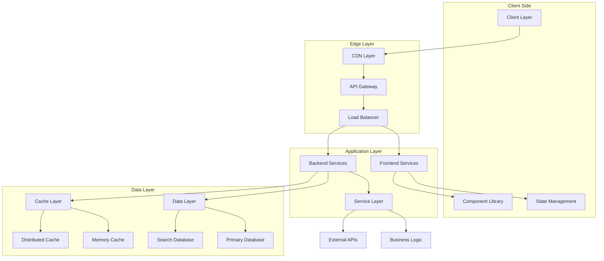

# 🏗️ System Design Architecture - IntelliChat Pro

## 📋 Overview

Comprehensive **system design blueprint** following **latest architecture patterns** and **best practices** for modern full-stack applications. This design ensures scalability, maintainability, and optimal performance while adhering to industry standards.

---

## 🎯 Architecture Philosophy

### 🔧 **Design Principles**
```typescript
interface ArchitecturePrinciples {
  separation_of_concerns: "Clear boundaries between layers";
  single_responsibility: "Each component has one purpose";
  dependency_inversion: "Depend on abstractions, not concretions";
  open_closed: "Open for extension, closed for modification";
  composition_over_inheritance: "Favor composition patterns";
  fail_fast: "Early error detection and handling";
  stateless_services: "Services should be stateless when possible";
  event_driven: "Reactive architecture with event-driven patterns";
}
```

### 🌐 **Modern Architecture Stack**


---

## 🎨 Frontend Architecture (Modern React Patterns)

### 📱 **Component Architecture**

#### **Atomic Design System**
```typescript
// Design system hierarchy following Atomic Design
interface AtomicDesignSystem {
  atoms: {
    purpose: "Basic building blocks";
    examples: ["Button", "Input", "Icon", "Text", "Avatar"];
    characteristics: ["Reusable", "Stateless", "Single responsibility"];
  };
  
  molecules: {
    purpose: "Simple combinations of atoms";
    examples: ["SearchBox", "FormField", "MessageBubble", "Toolbar"];
    characteristics: ["Functional units", "Minimal state", "Composable"];
  };
  
  organisms: {
    purpose: "Complex UI sections";
    examples: ["Header", "Sidebar", "ChatContainer", "MessageList"];
    characteristics: ["Feature-complete", "Stateful", "Domain-specific"];
  };
  
  templates: {
    purpose: "Page-level layouts";
    examples: ["ChatLayout", "AuthLayout", "DashboardLayout"];
    characteristics: ["Structure definition", "Responsive", "Flexible"];
  };
  
  pages: {
    purpose: "Specific page instances";
    examples: ["HomePage", "ChatPage", "LoginPage", "SettingsPage"];
    characteristics: ["Data integration", "Route handling", "Business logic"];
  };
}
```

#### **Component Structure Pattern**
```typescript
// Modern component structure following best practices
interface ComponentStructure {
  // 1. Component Definition
  component: {
    pattern: "Functional Components with TypeScript";
    hooks: ["useState", "useEffect", "useCallback", "useMemo"];
    customHooks: ["useChat", "useAuth", "useSocket", "useLocalStorage"];
  };
  
  // 2. Props Interface
  props: {
    pattern: "Strict TypeScript interfaces";
    validation: "Runtime validation with Zod";
    documentation: "JSDoc comments for complex props";
  };
  
  // 3. State Management
  state: {
    local: "useState for component-specific state";
    global: "Zustand for shared state";
    server: "TanStack Query for server state";
    form: "React Hook Form for form state";
  };
  
  // 4. Side Effects
  effects: {
    pattern: "useEffect with proper dependency arrays";
    cleanup: "Cleanup functions for subscriptions";
    optimization: "useCallback and useMemo for performance";
  };
  
  // 5. Error Handling
  errors: {
    boundaries: "Error boundaries at route level";
    async: "Error handling in async operations";
    user_feedback: "Toast notifications for errors";
  };
}

// Example implementation
interface ChatMessageProps {
  message: Message;
  isUser: boolean;
  onEdit?: (messageId: string) => void;
  onCopy?: (content: string) => void;
  onRegenerate?: (messageId: string) => void;
  className?: string;
}

const ChatMessage: React.FC<ChatMessageProps> = ({
  message,
  isUser,
  onEdit,
  onCopy,
  onRegenerate,
  className
}) => {
  // Hooks
  const [isHovered, setIsHovered] = useState(false);
  const [isAnimating, setIsAnimating] = useState(false);
  
  // Custom hooks
  const { formatMessage } = useMessageFormatter();
  const { copyToClipboard } = useClipboard();
  
  // Memoized computations
  const formattedContent = useMemo(() => 
    formatMessage(message.content), [message.content]
  );
  
  const messageActions = useMemo(() => [
    { icon: Copy, action: () => onCopy?.(message.content), label: "Copy" },
    { icon: Edit, action: () => onEdit?.(message.id), label: "Edit", condition: isUser },
    { icon: RotateCcw, action: () => onRegenerate?.(message.id), label: "Regenerate", condition: !isUser }
  ].filter(action => action.condition !== false), [message, isUser, onCopy, onEdit, onRegenerate]);
  
  // Event handlers
  const handleMouseEnter = useCallback(() => setIsHovered(true), []);
  const handleMouseLeave = useCallback(() => setIsHovered(false), []);
  
  // Effects
  useEffect(() => {
    if (message.isStreaming) {
      setIsAnimating(true);
      const timer = setTimeout(() => setIsAnimating(false), 500);
      return () => clearTimeout(timer);
    }
  }, [message.isStreaming]);
  
  return (
    <div 
      className={cn(
        "group relative p-4 transition-all duration-200",
        isUser ? "message-user" : "message-assistant",
        isAnimating && "animate-pulse",
        className
      )}
      onMouseEnter={handleMouseEnter}
      onMouseLeave={handleMouseLeave}
    >
      <div className="flex items-start space-x-3">
        <Avatar user={isUser ? message.user : { name: "AI", avatar: "/ai-avatar.png" }} />
        
        <div className="flex-1 min-w-0">
          <MessageContent content={formattedContent} />
          
          {message.toolCalls && (
            <ToolResultsDisplay toolCalls={message.toolCalls} />
          )}
          
          <MessageActions 
            actions={messageActions}
            visible={isHovered}
          />
        </div>
      </div>
    </div>
  );
};
```

### 🎨 **State Management Architecture**

#### **Zustand Store Pattern**
```typescript
// Global state management with Zustand
interface AppState {
  // User state
  user: User | null;
  isAuthenticated: boolean;
  
  // Chat state
  conversations: Conversation[];
  currentConversationId: string | null;
  messages: Record<string, Message[]>;
  
  // UI state
  sidebarOpen: boolean;
  theme: 'light' | 'dark' | 'system';
  
  // Real-time state
  isConnected: boolean;
  typingUsers: string[];
  
  // Actions
  actions: {
    // User actions
    login: (user: User) => void;
    logout: () => void;
    updateUser: (updates: Partial<User>) => void;
    
    // Chat actions
    setCurrentConversation: (id: string) => void;
    addMessage: (conversationId: string, message: Message) => void;
    updateMessage: (conversationId: string, messageId: string, updates: Partial<Message>) => void;
    
    // UI actions
    toggleSidebar: () => void;
    setTheme: (theme: Theme) => void;
    
    // Real-time actions
    setConnectionStatus: (connected: boolean) => void;
    addTypingUser: (userId: string) => void;
    removeTypingUser: (userId: string) => void;
  };
}

// Store implementation
export const useAppStore = create<AppState>()(
  devtools(
    persist(
      (set, get) => ({
        // Initial state
        user: null,
        isAuthenticated: false,
        conversations: [],
        currentConversationId: null,
        messages: {},
        sidebarOpen: true,
        theme: 'dark',
        isConnected: false,
        typingUsers: [],
        
        // Actions
        actions: {
          login: (user) => set({ user, isAuthenticated: true }),
          logout: () => set({ user: null, isAuthenticated: false }),
          updateUser: (updates) => set(state => ({ 
            user: state.user ? { ...state.user, ...updates } : null 
          })),
          
          setCurrentConversation: (id) => set({ currentConversationId: id }),
          
          addMessage: (conversationId, message) => set(state => ({
            messages: {
              ...state.messages,
              [conversationId]: [...(state.messages[conversationId] || []), message]
            }
          })),
          
          updateMessage: (conversationId, messageId, updates) => set(state => ({
            messages: {
              ...state.messages,
              [conversationId]: state.messages[conversationId]?.map(msg =>
                msg.id === messageId ? { ...msg, ...updates } : msg
              ) || []
            }
          })),
          
          toggleSidebar: () => set(state => ({ sidebarOpen: !state.sidebarOpen })),
          setTheme: (theme) => set({ theme }),
          
          setConnectionStatus: (connected) => set({ isConnected: connected }),
          addTypingUser: (userId) => set(state => ({
            typingUsers: [...state.typingUsers.filter(id => id !== userId), userId]
          })),
          removeTypingUser: (userId) => set(state => ({
            typingUsers: state.typingUsers.filter(id => id !== userId)
          }))
        }
      }),
      {
        name: 'intellichat-storage',
        partialize: (state) => ({
          user: state.user,
          isAuthenticated: state.isAuthenticated,
          theme: state.theme,
          sidebarOpen: state.sidebarOpen
        })
      }
    )
  )
);

// Selectors for performance optimization
export const useUser = () => useAppStore(state => state.user);
export const useAuth = () => useAppStore(state => ({
  user: state.user,
  isAuthenticated: state.isAuthenticated,
  login: state.actions.login,
  logout: state.actions.logout
}));
export const useChat = () => useAppStore(state => ({
  conversations: state.conversations,
  currentConversationId: state.currentConversationId,
  messages: state.messages,
  setCurrentConversation: state.actions.setCurrentConversation,
  addMessage: state.actions.addMessage,
  updateMessage: state.actions.updateMessage
}));
```

#### **TanStack Query Integration**
```typescript
// Server state management with TanStack Query
interface QueryKeys {
  conversations: ['conversations'];
  conversation: (id: string) => ['conversation', id];
  messages: (conversationId: string) => ['messages', conversationId];
  user: ['user'];
  tools: ['tools'];
}

export const queryKeys: QueryKeys = {
  conversations: ['conversations'],
  conversation: (id) => ['conversation', id],
  messages: (conversationId) => ['messages', conversationId],
  user: ['user'],
  tools: ['tools']
};

// Query hooks
export const useConversations = () => {
  return useQuery({
    queryKey: queryKeys.conversations,
    queryFn: () => api.conversations.getAll(),
    staleTime: 5 * 60 * 1000, // 5 minutes
    gcTime: 10 * 60 * 1000     // 10 minutes
  });
};

export const useMessages = (conversationId: string) => {
  return useQuery({
    queryKey: queryKeys.messages(conversationId),
    queryFn: () => api.messages.getByConversation(conversationId),
    enabled: !!conversationId,
    staleTime: 1 * 60 * 1000,  // 1 minute
    gcTime: 5 * 60 * 1000      // 5 minutes
  });
};

// Mutation hooks
export const useSendMessage = () => {
  const queryClient = useQueryClient();
  
  return useMutation({
    mutationFn: (data: { conversationId: string; content: string }) =>
      api.messages.send(data),
    
    onMutate: async (newMessage) => {
      // Optimistic update
      await queryClient.cancelQueries({
        queryKey: queryKeys.messages(newMessage.conversationId)
      });
      
      const previousMessages = queryClient.getQueryData(
        queryKeys.messages(newMessage.conversationId)
      );
      
      queryClient.setQueryData(
        queryKeys.messages(newMessage.conversationId),
        (old: Message[] = []) => [...old, {
          id: 'temp-' + Date.now(),
          content: newMessage.content,
          role: 'user',
          createdAt: new Date(),
          isOptimistic: true
        }]
      );
      
      return { previousMessages };
    },
    
    onError: (error, newMessage, context) => {
      // Rollback optimistic update
      queryClient.setQueryData(
        queryKeys.messages(newMessage.conversationId),
        context?.previousMessages
      );
    },
    
    onSettled: (data, error, variables) => {
      // Refetch to ensure consistency
      queryClient.invalidateQueries({
        queryKey: queryKeys.messages(variables.conversationId)
      });
    }
  });
};
```

### 🔗 **Custom Hooks Pattern**

#### **Business Logic Hooks**
```typescript
// Custom hooks for business logic
export const useChat = () => {
  const { user } = useAuth();
  const sendMessageMutation = useSendMessage();
  const { data: conversations } = useConversations();
  const [currentConversationId, setCurrentConversationId] = useState<string | null>(null);
  
  const sendMessage = useCallback(async (content: string, attachments?: File[]) => {
    if (!currentConversationId) {
      // Create new conversation
      const newConversation = await api.conversations.create({
        title: generateTitle(content),
        firstMessage: content
      });
      setCurrentConversationId(newConversation.id);
      return;
    }
    
    await sendMessageMutation.mutateAsync({
      conversationId: currentConversationId,
      content,
      attachments
    });
  }, [currentConversationId, sendMessageMutation]);
  
  const createNewChat = useCallback(() => {
    setCurrentConversationId(null);
  }, []);
  
  return {
    conversations,
    currentConversationId,
    setCurrentConversationId,
    sendMessage,
    createNewChat,
    isLoading: sendMessageMutation.isPending
  };
};

export const useSocket = () => {
  const [socket, setSocket] = useState<Socket | null>(null);
  const [isConnected, setIsConnected] = useState(false);
  const { user } = useAuth();
  
  useEffect(() => {
    if (!user) return;
    
    const socketInstance = io('/chat', {
      auth: { token: user.token }
    });
    
    socketInstance.on('connect', () => {
      setIsConnected(true);
      setSocket(socketInstance);
    });
    
    socketInstance.on('disconnect', () => {
      setIsConnected(false);
    });
    
    return () => {
      socketInstance.disconnect();
      setSocket(null);
      setIsConnected(false);
    };
  }, [user]);
  
  const emit = useCallback((event: string, data: any) => {
    socket?.emit(event, data);
  }, [socket]);
  
  const on = useCallback((event: string, callback: Function) => {
    socket?.on(event, callback);
    return () => socket?.off(event, callback);
  }, [socket]);
  
  return { socket, isConnected, emit, on };
};

export const useRealTimeMessages = (conversationId: string) => {
  const { on } = useSocket();
  const queryClient = useQueryClient();
  
  useEffect(() => {
    if (!conversationId) return;
    
    const unsubscribe = on('message:new', (message: Message) => {
      if (message.conversationId === conversationId) {
        queryClient.setQueryData(
          queryKeys.messages(conversationId),
          (old: Message[] = []) => [...old, message]
        );
      }
    });
    
    return unsubscribe;
  }, [conversationId, on, queryClient]);
};
```

---

## 🚀 Backend Architecture (Modern Node.js Patterns)

### 🏗️ **Clean Architecture Implementation**

#### **Layered Architecture**
```typescript
// Domain layer - Business entities and rules
export class User {
  constructor(
    public readonly id: UserId,
    public readonly email: Email,
    public readonly profile: UserProfile,
    private readonly hashedPassword: HashedPassword
  ) {}
  
  public changePassword(oldPassword: string, newPassword: string): void {
    if (!this.hashedPassword.verify(oldPassword)) {
      throw new Error('Invalid current password');
    }
    
    this.hashedPassword = HashedPassword.create(newPassword);
  }
  
  public updateProfile(updates: Partial<UserProfile>): void {
    // Business rules for profile updates
    this.profile.update(updates);
  }
}

export class Conversation {
  constructor(
    public readonly id: ConversationId,
    public readonly userId: UserId,
    public readonly settings: ConversationSettings,
    private messages: Message[] = []
  ) {}
  
  public addMessage(content: string, role: MessageRole): Message {
    const message = new Message(
      MessageId.generate(),
      this.id,
      content,
      role,
      new Date()
    );
    
    this.messages.push(message);
    return message;
  }
  
  public getContext(windowSize: number): Message[] {
    return this.messages.slice(-windowSize);
  }
}

// Application layer - Use cases and orchestration
export class ChatUseCase {
  constructor(
    private readonly userRepository: UserRepository,
    private readonly conversationRepository: ConversationRepository,
    private readonly messageRepository: MessageRepository,
    private readonly aiService: AIService,
    private readonly contextService: ContextService,
    private readonly eventBus: EventBus
  ) {}
  
  async sendMessage(command: SendMessageCommand): Promise<SendMessageResult> {
    // 1. Validate user and conversation
    const user = await this.userRepository.findById(command.userId);
    if (!user) throw new Error('User not found');
    
    const conversation = await this.conversationRepository.findById(command.conversationId);
    if (!conversation) throw new Error('Conversation not found');
    
    // 2. Check permissions
    if (conversation.userId !== command.userId) {
      throw new Error('Access denied');
    }
    
    // 3. Add user message
    const userMessage = conversation.addMessage(command.content, MessageRole.USER);
    await this.messageRepository.save(userMessage);
    
    // 4. Get context
    const context = await this.contextService.buildContext(user, conversation);
    
    // 5. Generate AI response
    const aiResponse = await this.aiService.generateResponse(
      conversation.getContext(10),
      context,
      conversation.settings
    );
    
    // 6. Add AI message
    const aiMessage = conversation.addMessage(aiResponse.content, MessageRole.ASSISTANT);
    aiMessage.setMetadata(aiResponse.metadata);
    await this.messageRepository.save(aiMessage);
    
    // 7. Update conversation
    await this.conversationRepository.save(conversation);
    
    // 8. Emit events
    this.eventBus.emit(new MessageSentEvent(userMessage));
    this.eventBus.emit(new MessageReceivedEvent(aiMessage));
    
    return new SendMessageResult(userMessage, aiMessage);
  }
}

// Infrastructure layer - External concerns
export class MongoUserRepository implements UserRepository {
  constructor(private readonly connection: MongoConnection) {}
  
  async findById(id: UserId): Promise<User | null> {
    const userData = await this.connection.collection('users').findOne({
      _id: new ObjectId(id.value)
    });
    
    if (!userData) return null;
    
    return new User(
      new UserId(userData._id.toString()),
      new Email(userData.email),
      UserProfile.fromData(userData.profile),
      HashedPassword.fromHash(userData.passwordHash)
    );
  }
  
  async save(user: User): Promise<void> {
    await this.connection.collection('users').updateOne(
      { _id: new ObjectId(user.id.value) },
      {
        $set: {
          email: user.email.value,
          profile: user.profile.toData(),
          updatedAt: new Date()
        }
      },
      { upsert: true }
    );
  }
}
```

#### **Service Layer Pattern**
```typescript
// Service interfaces
export interface AIService {
  generateResponse(
    messages: Message[],
    context: Context,
    settings: ConversationSettings
  ): Promise<AIResponse>;
  
  generateStreamingResponse(
    messages: Message[],
    context: Context,
    settings: ConversationSettings
  ): AsyncIterable<AIResponseChunk>;
}

export interface ContextService {
  buildContext(user: User, conversation: Conversation): Promise<Context>;
  updateUserContext(user: User, interaction: Interaction): Promise<void>;
  getRelevantKnowledge(query: string, userId: UserId): Promise<KnowledgeItem[]>;
}

// Service implementations
export class GroqAIService implements AIService {
  constructor(
    private readonly groqClient: GroqClient,
    private readonly toolRegistry: ToolRegistry,
    private readonly contextWeaver: ContextWeaver
  ) {}
  
  async generateResponse(
    messages: Message[],
    context: Context,
    settings: ConversationSettings
  ): Promise<AIResponse> {
    // 1. Weave context into prompt
    const systemPrompt = this.contextWeaver.weave(context, settings);
    
    // 2. Prepare messages for AI
    const aiMessages = this.prepareMessages(messages, systemPrompt);
    
    // 3. Get available tools
    const tools = this.toolRegistry.getAvailableTools(context.user.role);
    
    // 4. Call AI service
    const response = await this.groqClient.chat.completions.create({
      model: settings.model,
      messages: aiMessages,
      temperature: settings.temperature,
      max_tokens: settings.maxTokens,
      tools: tools.map(tool => tool.toOpenAIFormat()),
      tool_choice: 'auto'
    });
    
    // 5. Process tool calls if present
    let finalResponse = response.choices[0].message;
    
    if (finalResponse.tool_calls) {
      const toolResults = await this.executeToolCalls(
        finalResponse.tool_calls,
        context.user.id
      );
      
      // Get follow-up response
      const followUpMessages = [
        ...aiMessages,
        finalResponse,
        ...toolResults.map(result => ({
          role: 'tool' as const,
          content: JSON.stringify(result.data),
          tool_call_id: result.toolCallId
        }))
      ];
      
      const followUpResponse = await this.groqClient.chat.completions.create({
        model: settings.model,
        messages: followUpMessages,
        temperature: settings.temperature,
        max_tokens: settings.maxTokens
      });
      
      finalResponse = followUpResponse.choices[0].message;
    }
    
    return new AIResponse(
      finalResponse.content || '',
      {
        model: settings.model,
        tokens: response.usage || { prompt_tokens: 0, completion_tokens: 0, total_tokens: 0 },
        finishReason: response.choices[0].finish_reason,
        toolCalls: finalResponse.tool_calls
      }
    );
  }
  
  private async executeToolCalls(
    toolCalls: any[],
    userId: UserId
  ): Promise<ToolResult[]> {
    const results = await Promise.all(
      toolCalls.map(async (toolCall) => {
        try {
          const tool = this.toolRegistry.getTool(toolCall.function.name);
          if (!tool) throw new Error(`Tool not found: ${toolCall.function.name}`);
          
          const parameters = JSON.parse(toolCall.function.arguments);
          const result = await tool.execute(parameters, userId);
          
          return new ToolResult(toolCall.id, true, result);
        } catch (error) {
          return new ToolResult(toolCall.id, false, { error: error.message });
        }
      })
    );
    
    return results;
  }
}

export class LayeredContextService implements ContextService {
  constructor(
    private readonly sessionRepo: SessionRepository,
    private readonly conversationRepo: ConversationRepository,
    private readonly userRepo: UserRepository,
    private readonly knowledgeRepo: KnowledgeRepository,
    private readonly toolRepo: ToolRepository,
    private readonly temporalService: TemporalService
  ) {}
  
  async buildContext(user: User, conversation: Conversation): Promise<Context> {
    // Collect all context layers in parallel
    const [
      sessionContext,
      conversationContext,
      userContext,
      knowledgeContext,
      toolContext,
      temporalContext
    ] = await Promise.all([
      this.collectSessionContext(user.currentSessionId),
      this.collectConversationContext(conversation),
      this.collectUserContext(user),
      this.collectKnowledgeContext(user, conversation),
      this.collectToolContext(user),
      this.collectTemporalContext()
    ]);
    
    return new Context({
      session: sessionContext,
      conversation: conversationContext,
      user: userContext,
      knowledge: knowledgeContext,
      tool: toolContext,
      temporal: temporalContext
    });
  }
  
  private async collectConversationContext(
    conversation: Conversation
  ): Promise<ConversationContext> {
    const messages = conversation.getRecentMessages(20);
    const topicAnalysis = await this.analyzeTopics(messages);
    const sentimentAnalysis = await this.analyzeSentiment(messages);
    
    return new ConversationContext({
      currentTopic: topicAnalysis.currentTopic,
      topicHistory: topicAnalysis.history,
      sentiment: sentimentAnalysis.current,
      sentimentHistory: sentimentAnalysis.history,
      conversationFlow: this.analyzeConversationFlow(messages),
      messageCount: messages.length
    });
  }
}
```

### 🔌 **Event-Driven Architecture**

#### **Event System**
```typescript
// Domain events
export abstract class DomainEvent {
  public readonly occurredOn: Date;
  public readonly eventId: string;
  
  constructor() {
    this.occurredOn = new Date();
    this.eventId = crypto.randomUUID();
  }
}

export class MessageSentEvent extends DomainEvent {
  constructor(
    public readonly message: Message,
    public readonly conversation: Conversation,
    public readonly user: User
  ) {
    super();
  }
}

export class ConversationCreatedEvent extends DomainEvent {
  constructor(
    public readonly conversation: Conversation,
    public readonly user: User
  ) {
    super();
  }
}

// Event handlers
export interface EventHandler<T extends DomainEvent> {
  handle(event: T): Promise<void>;
}

export class MessageSentEventHandler implements EventHandler<MessageSentEvent> {
  constructor(
    private readonly contextService: ContextService,
    private readonly notificationService: NotificationService,
    private readonly analyticsService: AnalyticsService
  ) {}
  
  async handle(event: MessageSentEvent): Promise<void> {
    // Update user context based on message
    await this.contextService.updateUserContext(
      event.user,
      new MessageInteraction(event.message)
    );
    
    // Send real-time notification
    await this.notificationService.notifyMessageSent(
      event.conversation.id,
      event.message
    );
    
    // Track analytics
    await this.analyticsService.trackMessageSent({
      userId: event.user.id.value,
      conversationId: event.conversation.id.value,
      messageLength: event.message.content.length,
      timestamp: event.occurredOn
    });
  }
}

// Event bus
export class EventBus {
  private handlers = new Map<string, EventHandler<any>[]>();
  
  subscribe<T extends DomainEvent>(
    eventType: new (...args: any[]) => T,
    handler: EventHandler<T>
  ): void {
    const eventName = eventType.name;
    const existingHandlers = this.handlers.get(eventName) || [];
    this.handlers.set(eventName, [...existingHandlers, handler]);
  }
  
  async emit<T extends DomainEvent>(event: T): Promise<void> {
    const eventName = event.constructor.name;
    const handlers = this.handlers.get(eventName) || [];
    
    // Execute handlers in parallel
    await Promise.all(
      handlers.map(handler => 
        handler.handle(event).catch(error => {
          console.error(`Error handling event ${eventName}:`, error);
        })
      )
    );
  }
}
```

### 🛠️ **Dependency Injection Container**

#### **IoC Container Implementation**
```typescript
// Dependency injection container
export class Container {
  private services = new Map<string, any>();
  private factories = new Map<string, () => any>();
  
  register<T>(token: string, implementation: T): void {
    this.services.set(token, implementation);
  }
  
  registerFactory<T>(token: string, factory: () => T): void {
    this.factories.set(token, factory);
  }
  
  resolve<T>(token: string): T {
    // Check for direct registration
    if (this.services.has(token)) {
      return this.services.get(token);
    }
    
    // Check for factory
    if (this.factories.has(token)) {
      const instance = this.factories.get(token)!();
      this.services.set(token, instance); // Cache singleton
      return instance;
    }
    
    throw new Error(`Service not registered: ${token}`);
  }
}

// Service registration
export const configureServices = (container: Container): void => {
  // Infrastructure
  container.register('MongoConnection', new MongoConnection(config.MONGODB_URI));
  container.register('RedisConnection', new RedisConnection(config.REDIS_URL));
  container.register('GroqClient', new Groq({ apiKey: config.GROQ_API_KEY }));
  
  // Repositories
  container.registerFactory('UserRepository', () => 
    new MongoUserRepository(container.resolve('MongoConnection'))
  );
  container.registerFactory('ConversationRepository', () =>
    new MongoConversationRepository(container.resolve('MongoConnection'))
  );
  container.registerFactory('MessageRepository', () =>
    new MongoMessageRepository(container.resolve('MongoConnection'))
  );
  
  // Services
  container.registerFactory('AIService', () =>
    new GroqAIService(
      container.resolve('GroqClient'),
      container.resolve('ToolRegistry'),
      container.resolve('ContextWeaver')
    )
  );
  container.registerFactory('ContextService', () =>
    new LayeredContextService(
      container.resolve('SessionRepository'),
      container.resolve('ConversationRepository'),
      container.resolve('UserRepository'),
      container.resolve('KnowledgeRepository'),
      container.resolve('ToolRepository'),
      container.resolve('TemporalService')
    )
  );
  
  // Use cases
  container.registerFactory('ChatUseCase', () =>
    new ChatUseCase(
      container.resolve('UserRepository'),
      container.resolve('ConversationRepository'),
      container.resolve('MessageRepository'),
      container.resolve('AIService'),
      container.resolve('ContextService'),
      container.resolve('EventBus')
    )
  );
  
  // Event system
  container.register('EventBus', new EventBus());
  
  // Register event handlers
  const eventBus = container.resolve<EventBus>('EventBus');
  eventBus.subscribe(MessageSentEvent, new MessageSentEventHandler(
    container.resolve('ContextService'),
    container.resolve('NotificationService'),
    container.resolve('AnalyticsService')
  ));
};
```

---

## 🔄 API Design Patterns

### 🌐 **RESTful API with OpenAPI**

#### **API Structure**
```typescript
// API versioning and structure
interface APIStructure {
  versioning: {
    strategy: "URL versioning (/api/v1/)";
    current: "v1";
    deprecation: "Support n-1 versions";
  };
  
  resources: {
    auth: "/api/v1/auth/*";
    users: "/api/v1/users/*";
    conversations: "/api/v1/conversations/*";
    messages: "/api/v1/conversations/:id/messages/*";
    tools: "/api/v1/tools/*";
    files: "/api/v1/files/*";
  };
  
  standards: {
    http_methods: ["GET", "POST", "PUT", "PATCH", "DELETE"];
    status_codes: "Standard HTTP status codes";
    content_type: "application/json";
    authentication: "Bearer token";
  };
}

// OpenAPI specification generation
export const generateOpenAPISpec = (): OpenAPISpecification => ({
  openapi: "3.0.3",
  info: {
    title: "IntelliChat Pro API",
    version: "1.0.0",
    description: "AI-powered chat application API"
  },
  servers: [
    { url: "https://api.intellichat.pro/v1", description: "Production" },
    { url: "https://staging-api.intellichat.pro/v1", description: "Staging" },
    { url: "http://localhost:3001/api/v1", description: "Development" }
  ],
  components: {
    securitySchemes: {
      bearerAuth: {
        type: "http",
        scheme: "bearer",
        bearerFormat: "JWT"
      }
    },
    schemas: {
      User: {
        type: "object",
        properties: {
          id: { type: "string", format: "uuid" },
          email: { type: "string", format: "email" },
          username: { type: "string" },
          firstName: { type: "string" },
          lastName: { type: "string" },
          avatar: { type: "string", format: "uri" },
          role: { type: "string", enum: ["user", "premium", "admin"] },
          createdAt: { type: "string", format: "date-time" },
          updatedAt: { type: "string", format: "date-time" }
        }
      },
      Conversation: {
        type: "object",
        properties: {
          id: { type: "string", format: "uuid" },
          title: { type: "string" },
          status: { type: "string", enum: ["active", "archived", "deleted"] },
          messageCount: { type: "integer" },
          lastMessageAt: { type: "string", format: "date-time" },
          settings: { $ref: "#/components/schemas/ConversationSettings" },
          createdAt: { type: "string", format: "date-time" },
          updatedAt: { type: "string", format: "date-time" }
        }
      }
    }
  },
  paths: {
    "/conversations": {
      get: {
        summary: "List conversations",
        security: [{ bearerAuth: [] }],
        parameters: [
          {
            name: "page",
            in: "query",
            schema: { type: "integer", default: 1 }
          },
          {
            name: "limit",
            in: "query",
            schema: { type: "integer", default: 20, maximum: 100 }
          },
          {
            name: "status",
            in: "query",
            schema: { type: "string", enum: ["active", "archived"] }
          }
        ],
        responses: {
          "200": {
            description: "List of conversations",
            content: {
              "application/json": {
                schema: {
                  type: "object",
                  properties: {
                    data: {
                      type: "array",
                      items: { $ref: "#/components/schemas/Conversation" }
                    },
                    pagination: { $ref: "#/components/schemas/Pagination" }
                  }
                }
              }
            }
          }
        }
      },
      post: {
        summary: "Create conversation",
        security: [{ bearerAuth: [] }],
        requestBody: {
          content: {
            "application/json": {
              schema: {
                type: "object",
                properties: {
                  title: { type: "string" },
                  firstMessage: { type: "string" },
                  settings: { $ref: "#/components/schemas/ConversationSettings" }
                },
                required: ["firstMessage"]
              }
            }
          }
        },
        responses: {
          "201": {
            description: "Conversation created",
            content: {
              "application/json": {
                schema: { $ref: "#/components/schemas/Conversation" }
              }
            }
          }
        }
      }
    }
  }
});
```

#### **Controller Pattern**
```typescript
// Base controller with common functionality
export abstract class BaseController {
  protected handleAsync = (fn: Function) => {
    return (req: Request, res: Response, next: NextFunction) => {
      Promise.resolve(fn(req, res, next)).catch(next);
    };
  };
  
  protected sendSuccess<T>(
    res: Response,
    data: T,
    statusCode: number = 200,
    message?: string
  ): void {
    res.status(statusCode).json({
      success: true,
      data,
      message,
      timestamp: new Date().toISOString()
    });
  }
  
  protected sendError(
    res: Response,
    error: string,
    statusCode: number = 400,
    details?: any
  ): void {
    res.status(statusCode).json({
      success: false,
      error,
      details,
      timestamp: new Date().toISOString()
    });
  }
  
  protected sendPaginated<T>(
    res: Response,
    data: T[],
    pagination: PaginationInfo
  ): void {
    res.json({
      success: true,
      data,
      pagination,
      timestamp: new Date().toISOString()
    });
  }
}

// Conversation controller implementation
export class ConversationController extends BaseController {
  constructor(
    private readonly chatUseCase: ChatUseCase,
    private readonly conversationQuery: ConversationQuery
  ) {
    super();
  }
  
  getConversations = this.handleAsync(async (req: Request, res: Response) => {
    const { page = 1, limit = 20, status = 'active' } = req.query;
    const userId = req.user.id;
    
    const result = await this.conversationQuery.getByUser(userId, {
      page: Number(page),
      limit: Math.min(Number(limit), 100),
      status: status as string
    });
    
    this.sendPaginated(res, result.conversations, result.pagination);
  });
  
  createConversation = this.handleAsync(async (req: Request, res: Response) => {
    const { title, firstMessage, settings } = req.body;
    const userId = req.user.id;
    
    const command = new CreateConversationCommand(
      userId,
      title,
      firstMessage,
      settings
    );
    
    const result = await this.chatUseCase.createConversation(command);
    
    this.sendSuccess(res, result, 201, 'Conversation created successfully');
  });
  
  sendMessage = this.handleAsync(async (req: Request, res: Response) => {
    const { conversationId } = req.params;
    const { content, attachments } = req.body;
    const userId = req.user.id;
    
    const command = new SendMessageCommand(
      userId,
      conversationId,
      content,
      attachments
    );
    
    const result = await this.chatUseCase.sendMessage(command);
    
    this.sendSuccess(res, result, 201, 'Message sent successfully');
  });
}
```

---

## 🔒 Security Architecture

### 🛡️ **Security Layers**
```typescript
interface SecurityArchitecture {
  authentication: {
    strategy: "JWT with refresh tokens";
    implementation: "Auth middleware with token validation";
    features: ["Token rotation", "Secure storage", "Automatic refresh"];
  };
  
  authorization: {
    strategy: "RBAC (Role-Based Access Control)";
    implementation: "Permission decorators and guards";
    features: ["Route-level", "Resource-level", "Dynamic permissions"];
  };
  
  input_validation: {
    strategy: "Schema-based validation";
    implementation: "Zod schemas with custom validators";
    features: ["Type safety", "Runtime validation", "Sanitization"];
  };
  
  rate_limiting: {
    strategy: "Sliding window with Redis";
    implementation: "Express middleware with custom limits";
    features: ["Per-user limits", "Endpoint-specific", "Burst handling"];
  };
  
  data_protection: {
    strategy: "Encryption at rest and in transit";
    implementation: "TLS + database encryption";
    features: ["Field-level encryption", "Key rotation", "Audit trails"];
  };
}

// Security middleware stack
export const securityMiddleware = [
  helmet({
    contentSecurityPolicy: {
      directives: {
        defaultSrc: ["'self'"],
        scriptSrc: ["'self'", "'unsafe-inline'"],
        styleSrc: ["'self'", "'unsafe-inline'"],
        imgSrc: ["'self'", "data:", "https:"],
        connectSrc: ["'self'", "wss:", "ws:"]
      }
    }
  }),
  cors({
    origin: process.env.CORS_ORIGIN?.split(',') || ['http://localhost:3000'],
    credentials: true,
    optionsSuccessStatus: 200
  }),
  express.json({ limit: '10mb' }),
  express.urlencoded({ extended: true, limit: '10mb' }),
  compression(),
  authMiddleware,
  rateLimitMiddleware,
  validationMiddleware
];
```

---

This comprehensive system design provides a solid foundation for building a modern, scalable, and maintainable ChatGPT clone following the latest architecture patterns and best practices! 🚀