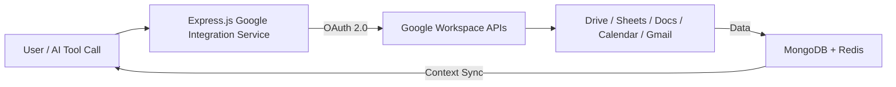

----------

# 🧩 Google Workspace Integration — IntelliChat Pro

## 📋 Overview

The **Google Workspace Integration Layer** connects IntelliChat Pro’s backend (Groq + Express.js) to the Google ecosystem — enabling:

-   Secure file storage & retrieval in **Google Drive**
    
-   Meeting & event scheduling in **Google Calendar**
    
-   Data manipulation in **Google Sheets**
    
-   Content generation in **Google Docs / Slides**
    
-   Communication automation via **Gmail API**
    

It allows users and developers to:

-   Use Google services as AI tools (e.g., “Summarize my Drive file” or “Create a meeting with John at 3PM”).
    
-   Seamlessly sync files and AI outputs to Drive.
    
-   Backup user content automatically.
    
-   Build business automations within IntelliChat Pro.
    

----------

## 🏗️ Architecture Overview

### 🧠 Core Concept



### ⚙️ Tech Components

Component

Description

**Google APIs**

Drive, Calendar, Sheets, Docs, Gmail

**Auth Layer**

OAuth 2.0 + Refresh Tokens (per user)

**Service Account**

For backend automation tasks

**Storage**

Google Drive as cloud file storage

**Database Link**

File and calendar metadata in MongoDB

**Caching**

Redis for quick workspace lookups

**Groq AI Tools**

Natural language tools to interact with Workspace

----------

## 🔐 Authentication & Setup

### 🧾 Google API Enablement

Enable the following APIs in your **Google Cloud Console**:

1.  Google Drive API
    
2.  Google Calendar API
    
3.  Google Sheets API
    
4.  Google Docs API
    
5.  Gmail API (optional)
    

### 🧩 OAuth 2.0 Flow

```typescript
interface GoogleAuthFlow {
  step1: "User clicks Connect Google Account";
  step2: "Redirects to Google OAuth consent screen";
  step3: "User grants requested scopes";
  step4: "Backend exchanges code for access + refresh token";
  step5: "Tokens stored encrypted in MongoDB";
  step6: "Refresh token auto-renewal using cron job";
}

```

**Example Scopes**

```env
https://www.googleapis.com/auth/drive
https://www.googleapis.com/auth/spreadsheets
https://www.googleapis.com/auth/calendar
https://www.googleapis.com/auth/documents
https://www.googleapis.com/auth/gmail.send

```

----------

## 🧱 Integration Services

### 📁 Google Drive Service

```typescript
interface DriveService {
  responsibilities: [
    "File upload and download",
    "AI-generated file storage",
    "Automatic backups",
    "Search and metadata retrieval"
  ];
  
  features: {
    backup: "Store chat exports, images, and PDFs",
    permissions: "Shared or private Drive folders",
    sync: "Link Drive files with conversations",
    indexing: "Store Drive file metadata in MongoDB"
  };
  
  endpoints: {
    "POST /api/google/drive/upload": "Upload file to user Drive",
    "GET /api/google/drive/files": "List files",
    "GET /api/google/drive/:id": "Download file",
    "DELETE /api/google/drive/:id": "Delete file from Drive"
  };
}

```

**Example Use Case**

> “Hey IntelliChat, upload this transcript to Drive in the ‘Client Meetings’ folder.”

→ The AI will automatically upload the chat PDF to Drive via the integration layer.

----------

### 🗓️ Google Calendar Service

```typescript
interface CalendarService {
  responsibilities: [
    "Create, edit, delete, list events",
    "AI-driven meeting scheduling",
    "Reminders and notifications"
  ];
  
  features: {
    eventCreation: "Add events with attendees & reminders",
    meetingSync: "Sync AI call events to user calendar",
    smartScheduling: "Find available slots using AI context"
  };
  
  endpoints: {
    "POST /api/google/calendar/event": "Create calendar event",
    "GET /api/google/calendar/events": "List upcoming events",
    "DELETE /api/google/calendar/event/:id": "Delete event"
  };
}

```

**Example Use Case**

> “Schedule a 30-minute call with John tomorrow at 3 PM and add it to my calendar.”

→ The backend uses Groq AI → Calendar API → confirms & saves in MongoDB.

----------

### 📊 Google Sheets Service

```typescript
interface SheetsService {
  responsibilities: [
    "Create and update spreadsheets",
    "Import/export structured data",
    "AI analysis on Sheets content"
  ];
  
  features: {
    readWrite: "CRUD operations on Sheets",
    reporting: "Export chat metrics to Sheets",
    dataSync: "Sync structured AI results to Sheets",
    formulas: "AI-assisted formula writing"
  };
  
  endpoints: {
    "POST /api/google/sheets/create": "Create new sheet",
    "GET /api/google/sheets/:id": "Get sheet data",
    "PUT /api/google/sheets/:id": "Update sheet",
    "POST /api/google/sheets/analyze": "Run AI analysis on sheet"
  };
}

```

**Example Use Case**

> “Analyze my ‘Project Budget’ sheet and summarize expenses over ₹50,000.”

→ Backend fetches data → Groq AI processes → returns structured insights.

----------

### 📑 Google Docs Service

```typescript
interface DocsService {
  responsibilities: [
    "Document generation",
    "Collaborative writing via AI",
    "Meeting summaries and reports"
  ];
  
  features: {
    createDocs: "Generate Docs using AI output",
    templates: "Auto-fill meeting notes or reports",
    formatting: "Apply rich text styles",
    linking: "Link Docs to conversation threads"
  };
  
  endpoints: {
    "POST /api/google/docs/create": "Create new document",
    "PUT /api/google/docs/:id": "Update document content",
    "GET /api/google/docs/:id": "Get document content"
  };
}

```

**Example Use Case**

> “Convert this chat into a formatted project report in Google Docs.”

→ AI generates → Backend uploads → returns Docs link.

----------

### 📧 Gmail Integration (Optional)

```typescript
interface GmailService {
  responsibilities: [
    "Send and draft emails from AI",
    "Read recent threads (context-based)",
    "Email automation for reports"
  ];
  
  features: {
    sendMail: "Send templated or AI-generated emails",
    replyAutomation: "Generate replies based on previous context",
    attachments: "Attach Drive or Docs files",
    logging: "Save sent mail metadata"
  };
  
  endpoints: {
    "POST /api/google/gmail/send": "Send email",
    "GET /api/google/gmail/threads": "List user email threads"
  };
}

```

----------

## 💾 Data Sync Model (MongoDB + Redis)

```typescript
interface GoogleIntegrationSchema {
  userId: ObjectId;
  googleUserId: string;
  tokens: {
    accessToken: string;
    refreshToken: string;
    expiryDate: Date;
  };
  linkedServices: string[]; // ["drive", "calendar", "sheets"]
  lastSync: Date;
  usageStats: {
    driveUploads: number;
    calendarEvents: number;
    sheetsCreated: number;
  };
}

```

Redis Cache Example:

```typescript
cacheKeys = {
  userDriveFiles: `drive:${userId}:files`,
  userCalendar: `calendar:${userId}:events`,
  sheetsData: `sheets:${userId}:${sheetId}`,
};

```

----------

## 🧠 AI + Tool Integration Layer

Each Workspace service will be registered as an **AI tool** in your **Tool Registry System**.

```typescript
tools.register({
  name: "google-drive",
  displayName: "Google Drive",
  description: "Upload, fetch, and manage Drive files.",
  handler: GoogleDriveTool,
  requiredRole: "user",
});

```

**Example AI Commands**

User Input

Tool Triggered

“Upload this chat to Drive.”

`google-drive.uploadFile()`

“Summarize my Sheet.”

`google-sheets.analyzeSheet()`

“Add a meeting at 5 PM.”

`google-calendar.createEvent()`

----------

## 🧩 Developer Features

Feature

Description

**Service Account Support**

For backend automations like backups or shared Docs creation

**Cron Scheduler**

Automatically back up user data to Drive nightly

**Unified Error Handling**

Centralized Google API error management via Axios interceptors

**Metrics & Logging**

Winston logs all Workspace actions for analytics

**Rate Limit Handling**

Smart retries and exponential backoff for Google APIs

**Permission Manager**

Role-based access for workspace tools (Pro users only)

----------

## 🚀 Deployment Notes

-   Create a **Google Cloud Project** with OAuth credentials.
    
-   Store credentials in environment variables:
    
    ```env
    GOOGLE_CLIENT_ID=
    GOOGLE_CLIENT_SECRET=
    GOOGLE_REDIRECT_URI=
    GOOGLE_SERVICE_ACCOUNT_KEY=
    
    ```
    
-   Mount credentials securely in Docker using secrets.
    
-   Ensure token encryption before storing in MongoDB.
    
-   Integrate with your monitoring layer (Sentry + Winston) for Google API calls.
    

----------

## 🧾 Future Enhancements

-   ✅ Google Meet integration for AI-scheduled calls
    
-   ✅ Auto-drive file summarization using Groq models
    
-   ✅ Docs + Sheets collaborative AI editing
    
-   ✅ Gmail + Calendar sync for enterprise workflows
    
-   ✅ Company-wide shared Drive folder creation per team
    

----------

## 🧠 Example Workflow

**User says:**

> “Create a meeting tomorrow at 3 PM with Priya, upload our project notes to Drive, and summarize in a Sheet.”

**Flow:**

1.  Chat Service receives user message
    
2.  Tool Registry detects Workspace tools needed
    
3.  CalendarService → creates event
    
4.  DriveService → uploads notes file
    
5.  SheetsService → summarizes + exports data
    
6.  MongoDB stores all action metadata
    
7.  User receives Drive + Calendar + Sheet links
    

----------

## 📚 Developer Docs Reference

Service

API Docs

Google Drive

[https://developers.google.com/drive/api/v3/reference](https://developers.google.com/drive/api/v3/reference)

Google Sheets

[https://developers.google.com/sheets/api/reference/rest](https://developers.google.com/sheets/api/reference/rest)

Google Docs

[https://developers.google.com/docs/api/reference/rest](https://developers.google.com/docs/api/reference/rest)

Google Calendar

[https://developers.google.com/calendar/api/v3/reference](https://developers.google.com/calendar/api/v3/reference)

Gmail API

[https://developers.google.com/gmail/api/reference/rest](https://developers.google.com/gmail/api/reference/rest)

